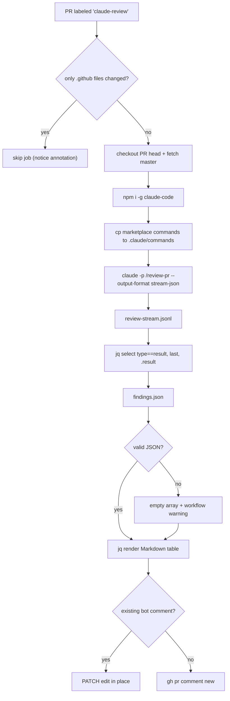

# Project 3 — Concepts reference

> Last updated: 2026-06-04 · Covers Day 10 of the CCA-F prep (Claude Code in CI)

A skim-before-the-exam reference of every concept Project 3 actually touched. Companion docs: [project-1-concepts](project-1-concepts.md), [project-2-concepts](project-2-concepts.md). Drill into [`marketplaces/cca-prep/plugins/cca-toolkit/commands/review-pr.md`](../marketplaces/cca-prep/plugins/cca-toolkit/commands/review-pr.md), [`.github/workflows/claude-review.yml`](../.github/workflows/claude-review.yml), or [`.claude/hooks/run-tests.sh`](../.claude/hooks/run-tests.sh) when you need the long form.

**Exam domain tags** map each concept to the 5 weighted CCA-F areas:
- `[ARCH]` Agentic Architecture & Orchestration (~27%)
- `[MCP]` Tool Design & MCP Integration (~18%)
- `[CC]` Claude Code Configuration & Workflows (~20%)
- `[PROMPT]` Prompt Engineering & Structured Output (~20%)
- `[REL]` Context Management & Reliability (~15%)

---

## Pipeline overview

The Day-10 surface area is two artefacts that act together in CI plus a hook that acts during interactive development.



Separately, while a human is working with Claude Code locally, edits trigger a typecheck via a PostToolUse hook — orthogonal to the CI workflow above but wired through the same `marketplaces/cca-prep/plugins/cca-toolkit` plugin.

---

## 1. Claude Code in CI — `claude -p` headless mode

### `claude -p` non-interactive runs `[CC]`
`claude -p "<prompt>"` runs Claude Code once, prints the model's reply, exits. Designed for scripts and CI. Three flags do the heavy lifting in [`claude-review.yml`](../.github/workflows/claude-review.yml):

- `--output-format stream-json` — emits a JSONL stream of events (one per line: assistant turn, tool calls, final `result`). The CI step pipes this to `review-stream.jsonl` so the final `result` event can be extracted with `jq` regardless of how chatty the run was.
- `--permission-mode bypassPermissions` — tells Claude Code not to prompt for tool approvals.
- `--dangerously-skip-permissions` — actually skips them in headless contexts. Required because no human is at the terminal to click "allow".

### Extracting the model's text from the stream `[CC]`
The stream has many event types — the final `{ "type": "result", "result": "..." }` event carries the complete reply. The workflow uses `jq -rs '[.[] | select(.type == "result")] | last | .result // empty'` to slurp the whole stream and pick the last `result` event. `sed -E '/^\`\`\`/d'` then strips stray fences the model sometimes still adds despite a "JSON only" prompt — a small but practical defense.

### Fallback on invalid JSON `[REL]`
`jq -e . findings.json` validates the file parses; on failure the step emits a `::warning::` annotation, dumps the raw output, and overwrites `findings.json` with `[]`. The workflow never fails the build — Claude returning rubbish silently degrades to "no findings", not a red CI. Trade-off: a model that consistently outputs malformed JSON would hide regressions; the warning annotation in the workflow run UI is the safety net.

---

## 2. The `/review-pr` slash command — written for a JSON consumer

### Slash-command frontmatter `[CC] [PROMPT]`
Frontmatter at the top of [`review-pr.md`](../marketplaces/cca-prep/plugins/cca-toolkit/commands/review-pr.md):

```yaml
---
description: Review the current PR diff and emit findings as a strict JSON array. Designed for headless GitHub Actions consumption.
allowed-tools: ["Read", "Grep", "Bash(git diff:*)", "Bash(git log:*)"]
model: claude-haiku-4-5
---
```

- `allowed-tools` is the slash-command equivalent of agent tool-gating: review tasks only need read + grep + diff/log — no writes, no edits, no arbitrary shell. The matchers `Bash(git diff:*)` / `Bash(git log:*)` allow the diff fetch but not other shell commands.
- `model: claude-haiku-4-5` — cheapest model that meets the bar for diff review; consistent with the Haiku-by-default convention across all three projects.

### `!`-prefixed shell interpolation inside slash commands `[CC]`
Slash-command markdown supports `!`-prefixed backtick snippets that run at expansion time:

```markdown
## Diff

!`git diff --no-color origin/master...HEAD`
```

The output of `git diff` is inlined into the prompt before it's sent to Claude. The CI workflow doesn't pass the diff as an arg — it relies on this interpolation running in the working tree (which is why the workflow checks out the PR head with `fetch-depth: 0` and references `origin/master`).

### Name the downstream consumer in the prompt `[PROMPT]`
The prompt explicitly tells the model:

> Respond with **ONLY** the JSON array — start your reply with `[` and end with `]`. No prose, no explanations, no code fences, no preamble. The CI `jq` parser fails loudly on anything else.

Naming the consumer (`jq`) in the prompt is load-bearing — the model behaves differently when "your output is read by humans" vs "your output is parsed by jq". The shape example in the prompt (severity / category / file / line / message / suggestion) doubles as the validation contract; `findings.json` is the artifact downstream steps consume.

---

## 3. GH Actions workflow walkthrough

### Trigger table `[CC]`

| Trigger | Condition | Result |
| --- | --- | --- |
| `pull_request: labeled` | label name = `claude-review` | review runs (`contains(github.event.pull_request.labels.*.name, 'claude-review')`) |
| `pull_request: synchronize` | label already on the PR | re-review after a push, edits the existing comment in place |
| `pull_request: opened` | label applied at open time | review runs once |
| any of the above | only `.github/` files changed | step-level gate sets `run=false`, all downstream steps skip via `if:` |

The `.github/`-only skip prevents the workflow from reviewing itself on every workflow tweak — a closed-loop the dev wants to avoid.

### Step-by-step in execution order `[CC]`

```yaml
- name: Checkout
  uses: actions/checkout@v4
  with:
    fetch-depth: 0
    ref: ${{ github.event.pull_request.head.sha }}
```

`fetch-depth: 0` pulls full history — required so `git diff origin/master...HEAD` inside the slash command resolves both refs.

```yaml
- name: Skip if only .github files changed
  id: gate
  run: |
    set -euo pipefail
    changed=$(git diff --name-only origin/master...HEAD)
    if echo "$changed" | grep -qvE '^\.github/'; then
      echo "run=true" >> "$GITHUB_OUTPUT"
    else
      echo "run=false" >> "$GITHUB_OUTPUT"
      echo "::notice::Skipping review — only .github files touched."
    fi
```

`grep -qv` reads as "any line that does NOT match `^\.github/`"; if such a line exists, there's a non-`.github` file in the diff and we run.

```yaml
- name: Materialise plugin commands at project level
  if: steps.gate.outputs.run == 'true'
  run: |
    mkdir -p .claude/commands
    cp marketplaces/cca-prep/plugins/cca-toolkit/commands/*.md .claude/commands/
```

Headless `/plugin install` isn't first-class yet. The workaround copies plugin commands into project-level `.claude/commands/` so `claude -p "/review-pr"` resolves the command without an interactive install. The plugin remains the canonical source.

```yaml
- name: Run /review-pr
  run: |
    claude -p "/review-pr" \
      --output-format stream-json \
      --permission-mode bypassPermissions \
      --dangerously-skip-permissions \
      > review-stream.jsonl

    jq -rs '[.[] | select(.type == "result")] | last | .result // empty' \
      review-stream.jsonl | sed -E '/^```/d' > findings.json

    jq -e . findings.json > /dev/null 2>&1 || {
      echo "::warning::Claude returned non-JSON output. Raw:"
      cat findings.json
      echo "[]" > findings.json
    }
```

Three sub-steps: capture the headless event stream, extract the final `result` event's text into `findings.json`, validate JSON shape with a fallback to `[]`.

```yaml
- name: Post / update PR comment
  run: |
    MARKER="<!-- claude-review-bot -->"
    body=$(jq -r --arg marker "$MARKER" '...' findings.json)

    existing=$(gh pr view "$PR_NUMBER" --repo "$REPO" --json comments \
      --jq ".comments[] | select(.body | contains(\"$MARKER\")) | .id" | head -n 1)

    if [ -n "$existing" ]; then
      gh api "repos/$REPO/issues/comments/$existing" -X PATCH -f body="$body"
    else
      gh pr comment "$PR_NUMBER" --repo "$REPO" --body "$body"
    fi
```

HTML-comment marker (`<!-- claude-review-bot -->`) is the idempotency token: the workflow finds its own previous comment by grepping the marker, then PATCHes it in place. On a re-push to the PR, the comment edits instead of appending — keeps the thread clean across `synchronize` events.

---

## 4. PostToolUse `run-tests.sh` — typecheck-as-feedback `[CC] [REL]`

### The contract
A PostToolUse hook fires after `Edit | Write | MultiEdit`. It receives `{tool_name, tool_input}` on stdin, runs whatever validation is appropriate, and (optionally) emits JSON on stdout with `hookSpecificOutput.additionalContext` — which the runtime injects as a system-reminder in the agent's next turn. The agent can then react to the feedback before the next user message.

### Routing first
```bash
case "$tool_name" in
  Edit|Write|MultiEdit) ;;
  *) exit 0 ;;
esac

case "$file_path" in
  *.ts|*.tsx) ;;
  *) exit 0 ;;
esac

case "$file_path" in
  *project-1-research*) project_dir="project-1-research" ;;
  *project-2-triage*)   project_dir="project-2-triage" ;;
  *) exit 0 ;;
esac
```

Cost-conscious routing. Edits to `.md`, `.json`, `.claude/`, `marketplaces/`, etc. exit 0 immediately — no tsc, no token spend. Only TS edits inside the two project apps continue to the typecheck.

### Failure → additionalContext
```bash
if tsc_output=$(cd "$project_path" && npx tsc --noEmit 2>&1); then
  exit 0
fi
clipped=$(printf '%s' "$tsc_output" | head -c 4000)
jq -n --arg dir "$project_dir" --arg out "$clipped" '{
  hookSpecificOutput: {
    hookEventName: "PostToolUse",
    additionalContext: (
      "[run-tests hook] Typecheck FAILED in `" + $dir + "` after the last edit. " +
      "Fix these errors before continuing:\n\n```\n" + $out + "\n```\n\n" +
      "If you intentionally introduced these errors and plan to fix them in a follow-up edit, " +
      "acknowledge them and continue. Otherwise, edit the source to make the typecheck green " +
      "before moving on."
    )
  }
}'
```

`head -c 4000` clips tsc output so a thousand cascading errors don't balloon the next turn's context — the first handful usually point at the root cause. The "intentional errors" escape hatch in the prompt is what prevents the hook from looping when the model is mid-refactor and the typecheck is briefly red on purpose.

### Known footgun
Shell hooks with CRLF line terminators die immediately on `set -euo pipefail` because `\r` becomes part of the option arg ("invalid option name `pipefail<CR>`"). Hook fails silently, no JSON on stdout, no `additionalContext` reaches the next turn, and the developer can't tell whether the hook ran or not. Always store hook scripts as LF-only. (The shipped scripts in this PR were authored CRLF and required a fix.)

---

## 5. Plugin vs project-level hook duality `[CC]`

The hook is wired in TWO places with identical body:

- **Plugin canonical source** — [`marketplaces/cca-prep/plugins/cca-toolkit/hooks/hooks.json`](../marketplaces/cca-prep/plugins/cca-toolkit/hooks/hooks.json) references `${PLUGIN_DIR}/hooks/run-tests.sh`. This is what other consumers of the plugin (`/plugin install cca-toolkit`) inherit.
- **Project-level dev-time install** — [`.claude/settings.json`](../.claude/settings.json) references `${CLAUDE_PROJECT_DIR}/.claude/hooks/run-tests.sh`. Lets the hook fire in this repo without first running `/plugin install`, which makes the hook ergonomic to iterate on while the plugin itself is under development.

`${PLUGIN_DIR}` and `${CLAUDE_PROJECT_DIR}` are the two path variables Claude Code interpolates at hook-load time — useful exam recall. If you flip the hook off, flip it in both files or you'll observe surprising fire/no-fire behaviour depending on whether the plugin was also installed.

---

## 6. Deliberately-flawed admin route — `/review-pr` demo asset `[CC]`

[`project-2-triage/app/api/admin/refunds/route.ts`](../project-2-triage/app/api/admin/refunds/route.ts) ships with a DO-NOT-MERGE banner at the top. Its job: give `/review-pr` something visibly wrong to find on its first real PR comment.

### Planted-flaws inventory

| # | Severity | Category | File:line | Issue |
| --- | --- | --- | --- | --- |
| 1 | blocker | security | `admin/refunds/route.ts:26` | `path.join(AUDIT_DIR, file ?? "default.jsonl")` — no sanitisation, so `?file=../../../etc/passwd` traverses out of `AUDIT_DIR`. |
| 2 | major | security | `admin/refunds/route.ts:25` vs `:32` | `fs.readFile` runs BEFORE the auth check, so an unauthenticated attacker can probe the filesystem regardless of credentials (the auth check is decorative). |
| 3 | major | security | `admin/refunds/route.ts:16` | `ADMIN_TOKEN` hardcoded inline; should come from `process.env`. |
| 4 | minor | correctness | `admin/refunds/route.ts:41` | `fs.writeFile(...)` without `await` — fire-and-forget. Loses log entries under load, and rejections become unhandled. |
| 5 | minor | security | `admin/refunds/route.ts:34` | Auth-failure response leaks the received `Authorization` header back to the client (`{ error: "unauthorized", received: auth }`). |

Use this file as the smoke-test target for any future change to `/review-pr` or `claude-review.yml`. If the workflow's PR comment doesn't surface flaws #1-#3 at minimum, something regressed.

---

## 7. Exam-domain heatmap

| Concept | Section | Domain |
| --- | --- | --- |
| `claude -p` headless mode + flags | §1 | `[CC]` |
| Stream-JSON extraction via `jq` | §1 | `[CC]` |
| Fallback to `[]` on invalid JSON | §1 | `[REL]` |
| Slash-command frontmatter (`allowed-tools`, `model`) | §2 | `[CC]` `[PROMPT]` |
| `!`-prefixed shell interpolation in slash commands | §2 | `[CC]` |
| Prompting for a downstream parser (jq-friendly output) | §2 | `[PROMPT]` |
| Label-gated `pull_request` workflow | §3 | `[CC]` |
| `.github`-only diff skip | §3 | `[CC]` |
| Idempotent PR comment via hidden marker + PATCH | §3 | `[CC]` |
| PostToolUse `additionalContext` injection | §4 | `[CC]` `[REL]` |
| Cost-conscious hook routing | §4 | `[CC]` |
| `head -c 4000` context-cap on hook output | §4 | `[REL]` |
| Plugin-vs-project hook duality (`${PLUGIN_DIR}` vs `${CLAUDE_PROJECT_DIR}`) | §5 | `[CC]` |
| Planted-flaws inventory as a demo target | §6 | `[CC]` |
