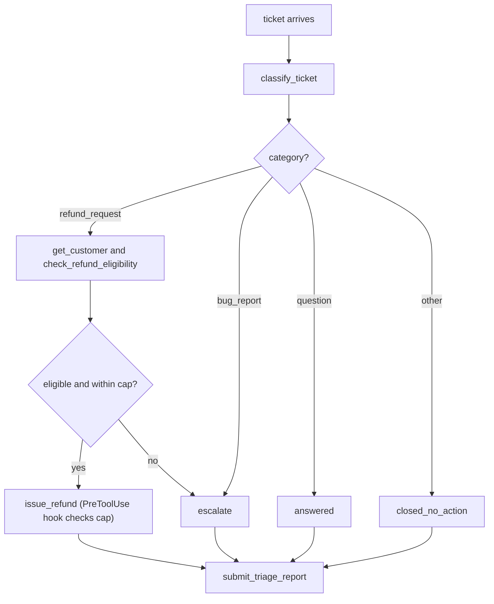
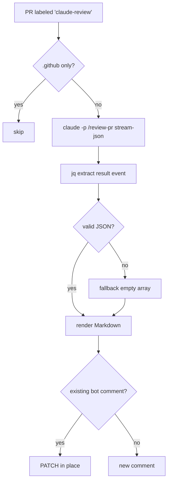
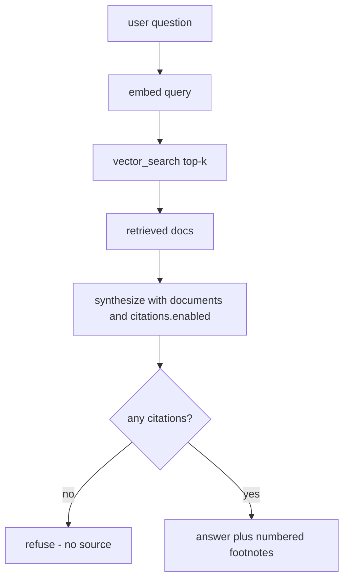
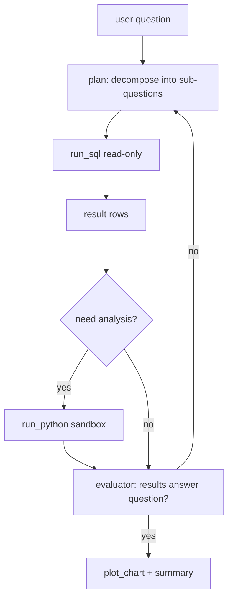
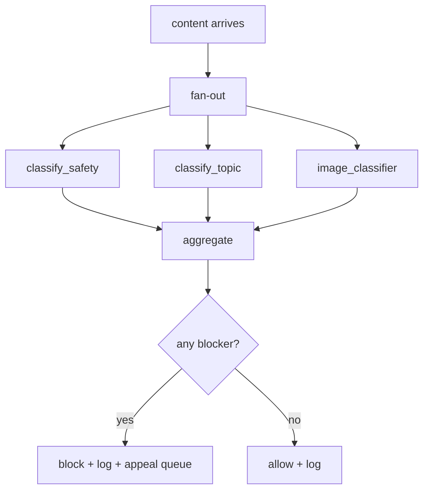
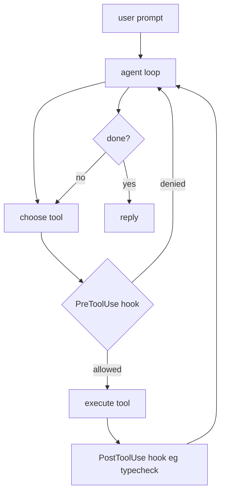

# Six scenario patterns — design-doc reference

> Last updated: 2026-06-05 · Companion to [project-1-concepts](project-1-concepts.md), [project-2-concepts](project-2-concepts.md), [project-3-concepts](project-3-concepts.md)

The CCA-F is scenario-driven — the exam describes a use case in prose and asks which architecture, tools, policies, and eval strategy fit. This doc enumerates the six recurring patterns, each as a one-page design doc with the same four sections: **architecture** (Mermaid), **tool surface**, **policies**, **eval strategy**. Each section closes with a pointer to the concrete project in this repo that demonstrates the pattern, when one exists.

**Workflow shapes** (from *Building effective agents*): prompt chaining · routing · parallelisation · orchestrator-workers · evaluator-optimiser · augmented LLM (single model + tools/retrieval/memory).

---

## 1. Customer-service refund / dispute agent

> **Workflow shape**: routing (single classifier dispatches to one of N actions) wrapped in a manual tool-use loop · **Maps to in repo**: [project-2-triage](../project-2-triage)

### Architecture

### Tool surface

| Tool | Source | Notes |
| --- | --- | --- |
| `classify_ticket` | inline TS | Deterministic regex fast-path; LLM fallback. |
| `get_customer` | inline TS | Read-only customer lookup. |
| `check_refund_eligibility` | inline TS | Returns `{eligible, reason, max_refund_cents}`. |
| `issue_refund` | MCP | Side-effect — separate process for blast-radius isolation. |
| `submit_triage_report` | inline TS (forced via `tool_choice: {type:"tool"}`) | Structured-output contract. |

### Policies
- **PreToolUse hook** on `issue_refund` enforces refund cap (e.g. 50,000 cents); over-cap calls are denied with structured deny reason.
- **PCI redaction**: regex + Luhn on all `tool_input` before audit log.
- **Fail-closed on prompt injection**: system prompt + tool gating require grounding (real `order_id` + `eligible=true`) before any refund.
- **Escalation triggers**: anger / chargeback / legal threat / asks-for-human / >cap / ambiguous "other" → action=`escalated`.
- **Forced recovery**: if model tries to `end_turn` without `submit_triage_report`, re-call with `tool_choice: {type:"tool", name:"submit_triage_report"}`.

### Eval strategy
- **Fixture**: Inspect-style `triage.jsonl` (16+ samples, `{id, input, target, metadata}`) covering each category × action combo plus one adversarial prompt-injection ticket.
- **Scorers** (all code-based — fast, deterministic):
  1. `category_match` — exact match on `report.ticket_category`.
  2. `action_match` — exact match on `report.action_taken`.
  3. `policy_violations` — rule-based: refund cap respected, action ⇔ refund/escalation presence consistent, `refund_issued` requires `refund_request`.
- **Threshold**: ≥ 12/16 passes per release. Re-run cheap during prompt iteration with `{"ids":[…]}` subset.
- **Re-determinism**: `temperature: 0`. Without it, one bad sample per pass masks real regressions.

---

## 2. CI/CD code-review agent

> **Workflow shape**: single-shot augmented LLM via headless `claude -p` · **Maps to in repo**: [project-3 — `/review-pr` + `claude-review.yml`](../marketplaces/cca-prep/plugins/cca-toolkit/commands/review-pr.md)

### Architecture

### Tool surface

| Tool | Source | Notes |
| --- | --- | --- |
| `Read` | built-in CC | Read source files cited by the diff. |
| `Grep` | built-in CC | Search for symbol usages, similar patterns. |
| `Bash(git diff:*)` | built-in CC (matcher-gated) | Fetch the diff via `!`-interpolation. |
| `Bash(git log:*)` | built-in CC (matcher-gated) | History context only. |

### Policies
- **Allowed-tools tight**: read-only set in slash-command frontmatter. No `Edit`, `Write`, arbitrary `Bash`.
- **Label-gating**: workflow only fires when PR carries `claude-review` label — cost control.
- **`.github`-only skip**: prevents self-review loop on workflow edits.
- **JSON-shape contract**: prompt names `jq` as the downstream consumer; output is "JSON array only, start with `[` end with `]`".
- **Fallback to `[]`** on invalid JSON — CI never reds out on a malformed model response; emits `::warning::` annotation instead.
- **Idempotent comment**: hidden HTML marker (`<!-- claude-review-bot -->`) → PATCH in place across `synchronize` events.
- **Cheap model**: `claude-haiku-4-5` for diff review.

### Eval strategy
- **Fixture**: one or more known-flawed PRs with a *planted-flaws inventory* (sev/category/file/line/why). See [project-2-triage/app/api/admin/refunds/route.ts](../project-2-triage/app/api/admin/refunds/route.ts) for a worked example with 5 planted flaws (path traversal, order-of-ops, hardcoded secret, missing await, auth header leak).
- **Scorers**:
  1. `flaws_recalled` — for each planted flaw severity ≥ `major`, was a finding within ±N lines on the same file? (code-based set-membership check)
  2. `severity_calibration` — Spearman correlation between assigned severities and ground-truth severities.
  3. `false_positive_rate` — findings on lines with no planted flaw, capped per PR.
- **Threshold**: 100 % recall on blockers, ≥ 80 % on majors, FP rate < 2 per PR.
- **Re-run**: re-label the demo PR with `claude-review` → workflow re-fires.

---

## 3. Internal-knowledge / RAG agent

> **Workflow shape**: augmented LLM (single model + retrieval) with first-party Citations · **Maps to in repo**: [project-1-research](../project-1-research) synthesizer (the orchestrator wrapper is project-1-specific; the RAG core is what's described here)

### Architecture

### Tool surface

| Tool | Source | Notes |
| --- | --- | --- |
| `vector_search` | MCP | Returns top-k chunks `{text, source_url, title}`. Cheap. |
| `fetch_document` | MCP | Optional — pulls full doc when a chunk is insufficient. |
| `web_search` | built-in CC | Optional fallback when vector index has no hit. |
| (no write tools) | — | Read-only knowledge agent. |

### Policies
- **Ground every claim via Citations API**: retrieved chunks become `document` content blocks with `citations: { enabled: true }`. The API rejects fabricated `cited_text` offsets server-side — attribution is verifiable rather than trusted.
- **Refuse without source**: if response has no citations, surface "no grounded answer found" rather than guessing.
- **PII redaction at index time**: emails / SSNs / card numbers stripped from chunks before embedding. Cheaper and safer than redacting at query time.
- **Cite-text in footer**: render `[N]` markers inline, list `cited_text + source_url` in a `## Sources` section so the user can audit.
- **`cited_text` is free in output tokens** — no extra cost vs. uncited answers.
- **Caveat**: Citations are not yet compatible with structured outputs. If you need JSON shape AND citations, run them as two calls.

### Eval strategy
- **Fixture**: golden Q&A set — `(question, expected_substring, expected_source_url)` rows. Mix easy retrieval, multi-hop, and "answer not in corpus" cases.
- **Scorers**:
  1. `substring_match` — does the answer contain `expected_substring`? (code-based)
  2. `citation_present` — is `expected_source_url` in the returned citations? (code-based)
  3. `no_hallucinated_sources` — every `source_url` in the response appears in the retrieved chunks? (code-based)
  4. `refuses_when_no_source` — for "not in corpus" rows, response is the refusal string. (code-based)
- **Threshold**: ≥ 90 % on each axis. Hallucinated sources is a hard zero.
- **LLM-as-judge** optional for nuance (does the answer actually answer the question?) — use a *different* model than the generator.

---

## 4. Data-analysis agent

> **Workflow shape**: evaluator-optimiser (LLM produces, LLM critiques, loop until quality bar) over orchestrator-workers · **Maps to in repo**: closest analogue is [project-1-research's planner→workers→synthesizer](../project-1-research/app/api/research/_lib.ts), adapted to DB queries.

### Architecture

### Tool surface

| Tool | Source | Notes |
| --- | --- | --- |
| `run_sql` | MCP | Read-only DB role. Hard timeout + row cap. |
| `run_python` | MCP (sandbox) | pandas + matplotlib, no network, ephemeral filesystem. |
| `plot_chart` | inline TS or MCP | Wraps matplotlib output → image block back to user. |
| `save_notebook` | inline TS | Persist the final report + chart. |

### Policies
- **Read-only DB credentials**: separate role with no `INSERT/UPDATE/DELETE/DDL`. Hard requirement, enforced at the DB, not in prompt.
- **Query cost cap**: `EXPLAIN` cost > N or row count > M → reject + ask LLM to refine.
- **PII column masking**: a denylist of columns (email, ssn, dob) returns `<masked>` regardless of role.
- **Python sandbox**: no `subprocess`, no socket; CPU/RAM/timeout limits. Reuses Anthropic's general guidance on code-execution tools.
- **Evaluator loop bound**: max 3 evaluator-rejected iterations before escalating to human ("ambiguous question").
- **`temperature: 0` on the evaluator** so the same critique doesn't ping-pong.

### Eval strategy
- **Fixture**: questions with deterministic numeric ground truth — e.g. "MoM revenue change for product X in Q1" with the exact figure. Include "no answer in data" and "ambiguous question" rows.
- **Scorers**:
  1. `numeric_match_with_tolerance` — `abs(answer - expected) / expected < 0.001` (code-based).
  2. `sql_safety` — did `run_sql` ever execute outside the allowlisted schema? Did it cost more than the cap? (code-based, audit-log driven)
  3. `python_safety` — did the sandbox stay sandboxed? (code-based)
  4. `refusal_on_ambiguous` — model asks a clarifying question rather than guessing. (LLM-as-judge)
- **Threshold**: 100 % on safety scorers (any breach = blocker); ≥ 85 % on numeric.

---

## 5. Content-moderation pipeline

> **Workflow shape**: parallelisation (fan-out N classifiers → aggregator) · **Maps to in repo**: no direct project, but the PreToolUse hook pattern in [project-1's PII guard](../project-1-research/app/api/research/_lib.ts) is the building block — a content gate that emits a structured decision.

### Architecture

### Tool surface

| Tool | Source | Notes |
| --- | --- | --- |
| `classify_safety` | inline LLM call | Categories: violence, self-harm, sexual, hate, harassment. |
| `classify_topic` | inline LLM call | Routing: which downstream channel? |
| `image_classifier` | inline LLM call with `image` content block | Same prompt, different modality. |
| `log_decision` | MCP / inline | Append-only audit log. Every decision, blocked or not. |
| (no generation tools) | — | This is a gate, not a generator. |

### Policies
- **Parallel, not sequential**: each classifier runs independently. Aggregator combines into a single decision (`block`/`allow`) with per-category sub-scores.
- **Audit log everything**: blocked AND allowed. Required for appeal review and threshold-recalibration.
- **Appeal workflow**: blocked content → queue with original + classifier scores. Human reviewer flips → retrain examples.
- **Refuse to generate evasion**: if a user prompt asks the model to *help them bypass moderation*, that itself is a flagged category.
- **Cheaper model per classifier** (`claude-haiku-4-5`) — fan-out cost stays linear in classifier count.
- **No `temperature: 0` shortcut**: keep small jitter for borderline cases; aggregate over multiple samples for high-confidence calls.

### Eval strategy
- **Fixture**: a labelled corpus, ideally 1000+, with intentional borderline cases (sarcasm, satire, news vs. incitement).
- **Scorers**:
  1. `precision_per_category` — of items flagged as `safety:violence`, how many were really violence?
  2. `recall_per_category` — of true-violence items, how many did we flag?
  3. `false_negative_severity` — weighted by harm tier — a missed CSAM is not a missed "mild profanity".
  4. `time_to_decision` — p95 latency. Moderation is on the user's hot path.
- **Threshold**: per-category precision/recall targets calibrated against industry baselines (Anthropic docs reference F1≥0.85 for sentiment-style tasks as a reference point; moderation often demands recall > 0.95 on blockers).

---

## 6. Developer-productivity / IDE agent

> **Workflow shape**: augmented LLM with broad tool surface + per-turn user oversight · **Maps to in repo**: Claude Code itself is the canonical example; project-3's PostToolUse hook ([`.claude/hooks/run-tests.sh`](../.claude/hooks/run-tests.sh)) shows the feedback-injection pattern.

### Architecture

### Tool surface

| Tool | Source | Notes |
| --- | --- | --- |
| `Read` / `Edit` / `Write` / `MultiEdit` | built-in CC | Filesystem. Edits guarded by Read-before-Edit invariant. |
| `Bash` | built-in CC | Matcher-gated via `allowed-tools` or PreToolUse hook. |
| `Glob` / `Grep` | built-in CC | Search. |
| `TaskCreate` and friends | built-in CC | Progress tracking. |
| Project-specific MCP servers | MCP | E.g. linter daemon, in-process notes, DB explorer. |
| Slash commands | plugin / project | Pre-composed task templates. |

### Policies
- **PreToolUse hooks for destructive shell**: `rm -rf`, `git push --force`, `--no-verify` etc. → deny with structured reason.
- **PostToolUse hooks for validation**: typecheck after every `*.ts` edit; surface failure via `hookSpecificOutput.additionalContext` so the agent self-corrects on the next turn.
- **`allowed-tools` per-slash-command**: review-style commands get read-only set; refactor-style commands get edit set.
- **Permission modes**: `default` / `acceptEdits` / `plan` / `bypassPermissions` — pick per task risk. Headless CI always uses `bypassPermissions` (no human at terminal).
- **CLAUDE.md / AGENTS.md load order**: enterprise → project → user → import. Project-level AGENTS.md is the place to say "this isn't the Next.js you know — read the bundled docs".
- **Cost cap**: prefer Haiku for routine work, Sonnet/Opus only when the task genuinely needs it.

### Eval strategy
- **Fixture**: a task suite — e.g. SWE-bench-style (issue → patch) for code-change tasks; for chat-style productivity, golden conversations with expected outputs.
- **Scorers**:
  1. `task_completion` — did the agent reach the goal? (LLM-as-judge OR test-suite-pass)
  2. `tool_count` and `turn_count` — proxy for cost and latency.
  3. `hook_fire_count_by_type` — `PreToolUse` denials surface fast feedback; `PostToolUse` corrections matter for self-healing.
  4. `regression_after_edit` — did `npx tsc --noEmit` go from green to red on the changed package? (code-based, this is exactly what `run-tests.sh` enforces interactively.)
- **Threshold**: task-completion ≥ 80 %, regression-after-edit = 0 (blocker), turn_count p95 under a budget.

---

## Cross-cutting recall

- The five workflow shapes from *Building effective agents* (prompt chaining · routing · parallelisation · orchestrator-workers · evaluator-optimiser) plus the *augmented LLM* primitive cover every pattern above. The exam frequently asks "which shape fits scenario X?" — these six docs are your scenario→shape mapping.
- **Code-based scorers > LLM-as-judge** when the scorable surface is structured. LLM-as-judge for nuance only, with a *different* model than the generator.
- **PreToolUse vs PostToolUse**: Pre denies before execution; Post emits `additionalContext` after. Both events apply to MCP tools too — not just built-ins.
- **`temperature: 0` for reproducibility** in evals. Default temperature in production where jitter is fine (moderation borderline cases benefit from non-zero).
- **Refuse + cite an escape hatch**: every safety-leaning policy ("refuse without source", "fail closed on prompt injection") needs the model to know what to *say* when refusing — otherwise you'll see brittle silent failures.
