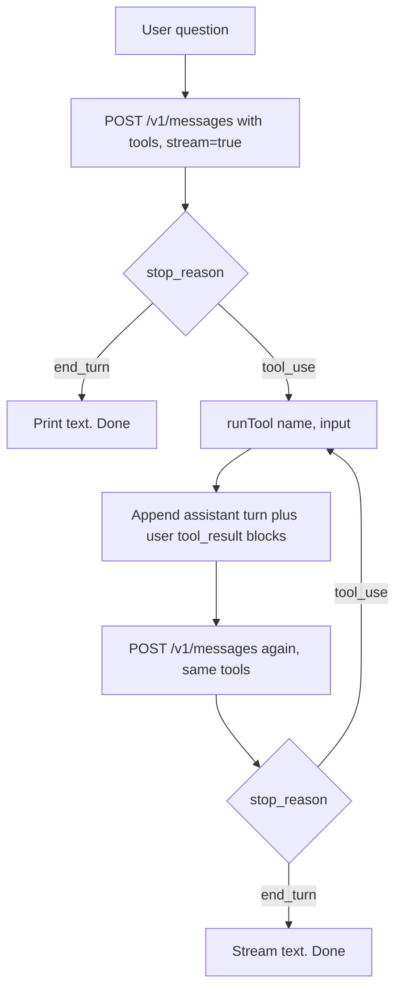
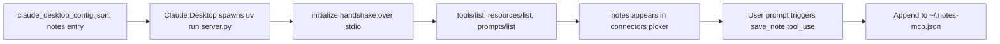

# Project 1 — Anthropic SDK + MCP Exploration

> Branch: `feat/project-1-research` · Last updated: 2026-05-20

## Overview

Small artifacts that isolate one concept each on the Anthropic API + MCP surfaces — tool definitions, the tool-use roundtrip, streaming, prompt caching, structured outputs, `tool_choice` semantics, and MCP servers (in-process via the Claude Agent SDK, plus a stdio reference variant).

**These notes lead with the SDK path for each concept.** Raw-protocol / non-canonical siblings exist in the same folder so you can see what the SDK abstracts, but they are intentionally minimized here — read the file directly if you want the full code.

## Files

| File | Purpose | Lead? |
|---|---|---|
| `tool-use-demo.ts` | Single-call SDK demo that prints a `tool_use` block. | — |
| `tool-use-roundtrip-sdk.ts` | Two-turn tool-use loop via `@anthropic-ai/sdk`, streamed. | **canonical** |
| `tool-use-roundtrip.ts` | Same flow without the SDK — raw `fetch` + hand-rolled SSE parser. | variant |
| `structured-json.ts` | Prompt+schema JSON output with graceful parse failure. | **canonical** |
| `tool-choice.md` | Reference table for `auto` / `any` / `tool` / `none` + `disable_parallel_tool_use`. | — |
| `note-server/agent-sdk-server.py` | Notes MCP server in-process inside a Claude Agent SDK script. | **canonical** |
| `note-server/server.py` | Same server as a stdio subprocess via FastMCP, registered with Claude Desktop. | variant |

The two paired files (`*-roundtrip.ts` and `note-server/*.py`) are side-by-side comparisons. The canonical variant is the one you'd ship; the other exists so you can see what the SDK is abstracting away.

## Tool-use roundtrip — `tool-use-roundtrip-sdk.ts`

Two-turn loop: model issues a `tool_use`, the script runs the (fake) tool, sends the result back, model produces the final answer. Streamed via `client.messages.stream()`.

1. Type the request using the SDK's exported types — `Tool[]` for the schema, `MessageParam[]` for the conversation, with `cache_control` on the last tool definition:

   ```ts
   import Anthropic from "@anthropic-ai/sdk";
   import {
     MessageParam, Tool, ToolResultBlockParam, ToolUseBlock,
   } from "@anthropic-ai/sdk/resources/messages/messages.mjs";

   const client = new Anthropic();
   const tools: Tool[] = [{
     name: "get_weather",
     description: "Get the current weather for a given location.",
     input_schema: { /* …object schema with location, unit… */ },
     cache_control: { type: "ephemeral" }, // caches `tools` across both turns
   }];
   const messages: MessageParam[] = [{ role: "user", content: "What's the weather in Paris?" }];
   ```

2. Open a stream, pipe text deltas to stdout, then `await stream.finalMessage()` for the fully-assembled, typed `Anthropic.Message`:

   ```ts
   const stream1 = client.messages.stream({ model: "claude-opus-4-7", max_tokens: 1024, tools, messages });
   stream1.on("text", (delta) => process.stdout.write(delta));
   const response = await stream1.finalMessage();
   ```

   `finalMessage()` accumulates content blocks and tool_use inputs for you — that's the main ergonomic win over the raw protocol.

3. Inspect `response.stop_reason`. If `"tool_use"`, narrow each `tool_use` block via the typed predicate and build one `tool_result` per call:

   ```ts
   if (response.stop_reason === "tool_use") {
     messages.push({ role: "assistant", content: response.content });
     const toolResults: ToolResultBlockParam[] = response.content
       .filter((b): b is ToolUseBlock => b.type === "tool_use")
       .map((b) => ({
         type: "tool_result",
         tool_use_id: b.id,                                  // ← must match the tool_use block
         content: runTool(b.name, b.input as Record<string, unknown>),
       }));
     messages.push({ role: "user", content: toolResults });
   }
   ```

   The `is ToolUseBlock` filter is the TS payoff: inside `.map`, `b.id` / `b.name` / `b.input` are all typed (no `any` on the content blocks).

4. Open a second stream with the same `tools`. The identical tool prefix is what makes `cache_control` worth attaching — turn 2 reads from cache if the combined `tools` + `system` prefix crosses 4096 tokens (Opus 4.7's minimum). At `stop_reason: "end_turn"`, read `response.usage.cache_read_input_tokens` to verify.

**Variant — `tool-use-roundtrip.ts`.** Same flow with no SDK. Replaces `client.messages.stream()` with a hand-rolled SSE reader that walks `message_start` → `content_block_start` → `content_block_delta` (text or `input_json_delta.partial_json`) → `content_block_stop` (parses accumulated JSON) → `message_delta` (stop reason + usage). Useful only as a protocol reference; ship the SDK version.

## Structured JSON — `structured-json.ts`

1. Send a single request with a system prompt that names every key, enumerates allowed `sentiment` values, and shows a worked example:

   ```ts
   const SCHEMA = {
     sentiment: "positive | negative | neutral",
     key_issues: "string[]",
     action_items: "{ team: string; task: string }[]",
   };
   const SYSTEM = `You output JSON only — no prose, no markdown fences, no preamble.
   The JSON must match this shape exactly: ${JSON.stringify(SCHEMA)}.
   sentiment must be one of: "positive", "negative", "neutral".
   Here is a worked example of the format:
   ${JSON.stringify(EXAMPLE, null, 2)}`;
   ```

2. `extractJson()` strips ```` ```json ```` fences if present and otherwise grabs the outer `{…}`:

   ```ts
   function extractJson(raw: string): string | null {
     const fence = raw.match(/```(?:json)?\s*([\s\S]*?)```/);
     if (fence) return fence[1].trim();
     const start = raw.indexOf("{");
     const end = raw.lastIndexOf("}");
     if (start !== -1 && end > start) return raw.slice(start, end + 1);
     return null;
   }
   ```

3. `parseFeedback()` runs `JSON.parse`, then validates each field. Each failure produces a readable error and ships the raw response back so you can diagnose drift:

   ```ts
   if (!["positive", "negative", "neutral"].includes(parsed.sentiment))
     return { ok: false, error: `invalid sentiment: ${parsed.sentiment}`, raw };
   if (!Array.isArray(parsed.key_issues) || !parsed.key_issues.every((x) => typeof x === "string"))
     return { ok: false, error: "key_issues must be string[]", raw };
   ```

4. Returns a discriminated union; caller branches on `result.ok`. The success path gets the typed `Feedback`; the failure path gets `{error, raw}` for the log.

## Notes MCP server — `note-server/agent-sdk-server.py`

Tools live as Python coroutines inside an Agent SDK script. No subprocess, no `claude_desktop_config.json` — the server is wired into the run via `ClaudeAgentOptions`.

1. Declare each tool with `@tool(name, description, input_schema)`. Handler is `async`, takes a single `args: dict`, and returns the MCP `content` shape explicitly:

   ```python
   from claude_agent_sdk import tool, create_sdk_mcp_server, ClaudeAgentOptions, query

   @tool("save_note", "Save a note with a title and body.", {"title": str, "body": str})
   async def save_note(args: dict) -> dict:
       notes = _load()
       notes.append({"title": args["title"], "body": args["body"], "created_at": datetime.now().isoformat()})
       _save(notes)
       return {"content": [{"type": "text", "text": f"Saved note '{args['title']}' ({len(notes)} total)."}]}
   ```

2. The in-process SDK MCP server **supports tools only, not resources** — so the stdio variant's `notes://recent` resource becomes a `recent_notes` tool with an empty input schema:

   ```python
   @tool("recent_notes", "Return the 10 most recent notes, newest first.", {})
   async def recent_notes(_args: dict) -> dict: ...
   ```

3. Build the server with `create_sdk_mcp_server` and wire it into the run. Tool names are namespaced — the SDK rewrites every in-process tool to `mcp__<server>__<tool>` before Claude sees it, so `allowed_tools` uses that form:

   ```python
   notes_server = create_sdk_mcp_server(name="notes", version="1.0.0", tools=[save_note, recent_notes])

   options = ClaudeAgentOptions(
       mcp_servers={"notes": notes_server},
       allowed_tools=["mcp__notes__save_note", "mcp__notes__recent_notes"],
   )
   async for message in query(prompt="...", options=options):
       print(message)
   ```

4. The Agent SDK spawns the Claude Code CLI as the conversation host. When Claude wants a tool, the SDK routes the call directly to the in-process Python handler — no JSON-RPC, no second subprocess for the server.

**Variant — `note-server/server.py`** (stdio + FastMCP, registered in Claude Desktop). The same notes API as a separate subprocess: `FastMCP("notes")`, `@mcp.tool()` for `save_note`, `@mcp.resource("notes://recent")` for the recent endpoint (FastMCP supports resources), `mcp.run()` for stdio transport. Claude Desktop spawns it per the entry in `~/Library/Application Support/Claude/claude_desktop_config.json`. Reach for this when you want the server reachable from Claude Desktop's chat UI directly, when multiple MCP hosts need to share the server, or when you actually need MCP resources (which the in-process Agent SDK form doesn't expose).

Both variants write to the same `~/.notes-mcp.json`, so you can save via one and read back through the other.

## Flowcharts

Tool-use roundtrip — what happens between the user question and the final assistant text:



MCP registration — stdio variant (kept here because in-process is uninteresting; it's just a Python function call):



## Glossary

- **Tool use** — the API pattern where Claude returns a `tool_use` content block describing a function call the caller should run, then expects a `tool_result` block back on the next turn.
- **`tool_use_id`** — opaque ID on each `tool_use` block; the corresponding `tool_result` must reference it so the model knows which call the result belongs to. Example: `{ type: "tool_result", tool_use_id: "toolu_01...", content: "72°F" }`.
- **`stop_reason`** — top-level field on the response telling you why the model stopped: `end_turn`, `max_tokens`, `tool_use`, `stop_sequence`, `pause_turn`, `refusal`.
- **SSE (Server-Sent Events)** — the transport the Messages API uses when `stream: true`. Plain HTTP with `data: <json>` lines separated by blank lines.
- **`content_block_delta`** — SSE event carrying an incremental update for one content block (`text_delta` for streamed text, `input_json_delta` carrying `partial_json` fragments for `tool_use` inputs).
- **`cache_control`** — per-block marker (`{type: "ephemeral"}`) that names the end of a cacheable prefix. Render order is `tools` → `system` → `messages`; the marker caches everything up to and including its block.
- **Prefix match** — caching invariant: any byte change anywhere before the marker invalidates the cache. Practically: never put `cache_control` on something that varies per request.
- **Adaptive thinking** — Opus 4.7's only thinking mode. `thinking: {type: "adaptive"}` lets the model decide depth; the fixed `budget_tokens` parameter is removed.
- **Stdio MCP** — Model Context Protocol over stdin/stdout. The host (Claude Desktop) spawns the server as a subprocess; both sides exchange JSON-RPC messages.
- **In-process MCP** — Claude Agent SDK pattern where tools live as Python coroutines in the agent script. Same MCP surface to Claude, but no IPC.
- **FastMCP** — high-level Python class in the `mcp` SDK. Wraps the JSON-RPC plumbing so you declare tools/resources/prompts with decorators (`@mcp.tool()`, `@mcp.resource("uri://…")`).
- **PEP 723 inline deps** — `# /// script` header in a single-file Python script declaring `dependencies`. `uv run --script path.py` reads it and runs in an isolated env without a `pyproject.toml` or venv.

## API reference

### TypeScript

| Symbol | File | Purpose |
| --- | --- | --- |
| `runTool(name, input)` | `tool-use-roundtrip*.ts` | Fake tool executor — returns a canned weather string for `get_weather`. |
| `streamClaude(messages)` | `tool-use-roundtrip.ts` (variant) | Raw-fetch SSE parser. Returns `{content, stop_reason, usage}`. |
| `extractJson(raw)` | `structured-json.ts` | Strips markdown fences; falls back to the outer `{…}`. Returns `string \| null`. |
| `parseFeedback(raw)` | `structured-json.ts` | Discriminated union: `{ok: true, value: Feedback} \| {ok: false, error, raw}`. |
| `callClaude(userText)` | `structured-json.ts` | Single non-streaming `POST /v1/messages` call with the JSON-mode system prompt. |

### Python (MCP)

| Symbol | File | Purpose |
| --- | --- | --- |
| `save_note(args)` | `note-server/agent-sdk-server.py` | `@tool("save_note", ...)` — async handler; returns MCP `content` dict. |
| `recent_notes(_args)` | `note-server/agent-sdk-server.py` | `@tool("recent_notes", ...)` — async handler; in-process replacement for `notes://recent`. |
| `notes_server` | `note-server/agent-sdk-server.py` | `create_sdk_mcp_server(...)` result. Passed to `ClaudeAgentOptions.mcp_servers`. |
| `save_note(title, body)` | `note-server/server.py` (variant) | `@mcp.tool()` — FastMCP tool, returns confirmation string. |
| `recent_notes()` | `note-server/server.py` (variant) | `@mcp.resource("notes://recent")` — FastMCP resource. |
| `_load()` / `_save(notes)` | `note-server/*.py` (shared pattern) | Tolerant JSON read/write helpers (empty list on missing file or parse error). |
