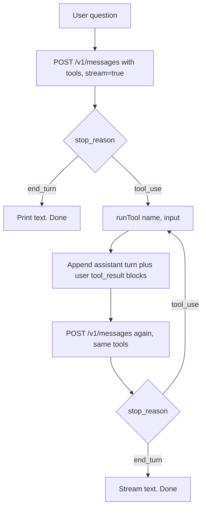
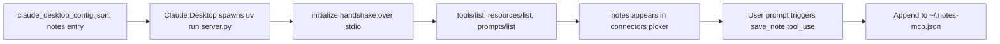

# Project 1 — Anthropic SDK + MCP Exploration

> Branch: `feat/project-1-research` · Last updated: 2026-05-19

## Overview

Six small artifacts, each isolating one concept on the Anthropic API + MCP surfaces. Goal is to understand each primitive in the smallest runnable form before building anything larger — tool definitions, the tool-use roundtrip, streaming, prompt caching, structured outputs, `tool_choice` semantics, and a hand-built stdio MCP server.

## What changed

- `tool-use-demo.ts` — SDK, one API call. Sends a `get_weather` tool definition; prints the model's `tool_use` block. Stops at `stop_reason: "tool_use"` (does not execute the tool).
- `tool-use-roundtrip.ts` — raw `fetch`, no SDK. Same tool, full two-turn loop: model returns `tool_use`, the script executes the (fake) tool, sends `tool_result` back, model produces a natural-language answer. Streams via a hand-rolled SSE parser. `cache_control` on the last tool definition with inline notes on prefix-match rules and the 4096-token cache minimum on Opus 4.7.
- `tool-use-roundtrip-sdk.ts` — SDK equivalent of the above. Uses `client.messages.stream()`, `stream.on("text", …)`, and `stream.finalMessage()`. Same cache placement.
- `structured-json.ts` — JSON output via prompt+schema. Prefill is unsupported on Opus 4.7, so the schema and a worked example live in the system prompt. Parses the response with an `extractJson()` (strips markdown fences) and a `parseFeedback()` that returns `{ok, value} | {ok: false, error, raw}` — covers parse failures, missing keys, wrong types, bad enum values.
- `tool-choice.md` — reference table for `auto` / `any` / `tool` / `none` and how `disable_parallel_tool_use` changes each.
- `note-server/server.py` — minimal stdio MCP server using `FastMCP`. One tool (`save_note(title, body)` → appends to `~/.notes-mcp.json`), one resource (`notes://recent` → last 10 notes). PEP 723 inline-deps header so `uv run --script server.py` works without a venv. Wired into Claude Desktop's `mcpServers` config and verified end-to-end.

The shared shape that drives everything in the TS scripts:

```ts
const TOOLS = [
  {
    name: "get_weather",
    description: "Get the current weather for a given location.",
    input_schema: {
      type: "object",
      properties: {
        location: { type: "string", description: "City and state" },
        unit: { type: "string", enum: ["celsius", "fahrenheit"] },
      },
      required: ["location"],
    },
    cache_control: { type: "ephemeral" }, // caches `tools` prefix
  },
];
```

## Code flow

### Tool-use roundtrip (`tool-use-roundtrip-sdk.ts`)

> Walkthrough uses the SDK version. The raw-fetch sibling (`tool-use-roundtrip.ts`) follows the same flow; the SSE parser it has to write by hand is shown at the end of this section for reference.

1. Type the request using the SDK's exported types — `Tool[]` for the schema, `MessageParam[]` for the conversation, with `cache_control` on the last tool definition:

   ```ts
   import Anthropic from "@anthropic-ai/sdk";
   import {
     MessageParam, Tool, ToolResultBlockParam, ToolUseBlock,
   } from "@anthropic-ai/sdk/resources/messages/messages.mjs";

   const client = new Anthropic();

   const tools: Tool[] = [
     {
       name: "get_weather",
       description: "Get the current weather for a given location.",
       input_schema: { /* …object schema with location, unit… */ },
       cache_control: { type: "ephemeral" }, // caches `tools` across both turns
     },
   ];

   const messages: MessageParam[] = [
     { role: "user", content: "What's the weather in Paris?" },
   ];
   ```

2. Open a stream with `client.messages.stream()`. Pipe text deltas to stdout, then `await stream.finalMessage()` for the fully-assembled, typed `Anthropic.Message`:

   ```ts
   const stream1 = client.messages.stream({
     model: "claude-opus-4-7", max_tokens: 1024, tools, messages,
   });
   stream1.on("text", (delta) => process.stdout.write(delta));
   const response = await stream1.finalMessage();
   ```

   `finalMessage()` is what makes the SDK ergonomic — it accumulates content blocks and tool_use inputs for you (the raw-fetch version has to do that by hand; see the SSE parser at the bottom of this section).

3. Inspect `response.stop_reason`. If `"tool_use"`, narrow each `tool_use` block via the typed predicate and build one `tool_result` per call:

   ```ts
   if (response.stop_reason === "tool_use") {
     messages.push({ role: "assistant", content: response.content });

     const toolResults: ToolResultBlockParam[] = response.content
       .filter((b): b is ToolUseBlock => b.type === "tool_use")
       .map((b) => ({
         type: "tool_result",
         tool_use_id: b.id,                                  // ← must match the tool_use block
         content: runTool(b.name, b.input as Record<string, unknown>),
       }));

     messages.push({ role: "user", content: toolResults });
   }
   ```

   The `is ToolUseBlock` filter is the TS payoff: inside `.map`, `b` is narrowed so `b.id` / `b.name` / `b.input` are all typed (no `any` casts on the content blocks themselves).

4. Open a second stream with the same `tools`. The identical tool prefix is what makes `cache_control` worth attaching — turn 2 reads from cache if the combined `tools` + `system` prefix crosses 4096 tokens (Opus 4.7's minimum).

   ```ts
   const stream2 = client.messages.stream({
     model: "claude-opus-4-7", max_tokens: 1024, tools, messages,
   });
   stream2.on("text", (delta) => process.stdout.write(delta));
   response = await stream2.finalMessage();
   ```

5. Second `finalMessage()` resolves with `stop_reason: "end_turn"`. Print `response.usage` to inspect cache columns: `cache_read_input_tokens` (reads, ~0.1× cost) and `cache_creation_input_tokens` (writes, ~1.25× cost on the 5-minute TTL).

#### What the SDK abstracts (raw-fetch variant)

`tool-use-roundtrip.ts` replicates `client.messages.stream()` by reading SSE chunks manually. Text deltas land on stdout as they arrive; `tool_use` inputs arrive as JSON string fragments (`input_json_delta.partial_json`) and only become valid JSON at `content_block_stop`. The core switch:

```ts
switch (ev.type) {
  case "message_start":
    usage = ev.message.usage; // cache_read/creation_input_tokens land here
    break;
  case "content_block_start":
    content[ev.index] = ev.content_block.type === "tool_use"
      ? { ...ev.content_block, input: "" } // accumulate input chars
      : { ...ev.content_block };
    break;
  case "content_block_delta": {
    const block = content[ev.index];
    if (ev.delta.type === "text_delta") {
      block.text += ev.delta.text;
      process.stdout.write(ev.delta.text);
    } else if (ev.delta.type === "input_json_delta") {
      block.input += ev.delta.partial_json;
    }
    break;
  }
  case "content_block_stop": {
    const block = content[ev.index];
    if (block.type === "tool_use") block.input = JSON.parse(block.input || "{}");
    break;
  }
  case "message_delta":
    if (ev.delta.stop_reason) stop_reason = ev.delta.stop_reason;
    break;
}
```

Everything else in the raw-fetch flow (appending the assistant turn, building `tool_result` blocks, the second call) is identical — the only difference is the absence of typed content-block narrowing.

### Structured JSON (`structured-json.ts`)

1. Send a single request with a system prompt that names every key, enumerates allowed `sentiment` values, and shows a worked example:

   ```ts
   const SCHEMA = {
     sentiment: "positive | negative | neutral",
     key_issues: "string[]",
     action_items: "{ team: string; task: string }[]",
   };

   const SYSTEM = `You output JSON only — no prose, no markdown fences, no preamble.
   The JSON must match this shape exactly: ${JSON.stringify(SCHEMA)}.
   sentiment must be one of: "positive", "negative", "neutral".
   Here is a worked example of the format:
   ${JSON.stringify(EXAMPLE, null, 2)}`;
   ```

2. Read the first `text` block from `response.content`.
3. `extractJson()` strips ```` ```json ```` fences if present and otherwise grabs the outer `{…}`:

   ```ts
   function extractJson(raw: string): string | null {
     const fence = raw.match(/```(?:json)?\s*([\s\S]*?)```/);
     if (fence) return fence[1].trim();
     const start = raw.indexOf("{");
     const end = raw.lastIndexOf("}");
     if (start !== -1 && end > start) return raw.slice(start, end + 1);
     return null;
   }
   ```

4. `parseFeedback()` runs `JSON.parse`, then validates: `sentiment` ∈ {positive, negative, neutral}, `key_issues` is `string[]`, `action_items` is `{team, task}[]`. Each failure produces a readable error and ships the raw response back:

   ```ts
   if (!["positive", "negative", "neutral"].includes(parsed.sentiment))
     return { ok: false, error: `invalid sentiment: ${parsed.sentiment}`, raw };
   if (!Array.isArray(parsed.key_issues) || !parsed.key_issues.every((x) => typeof x === "string"))
     return { ok: false, error: "key_issues must be string[]", raw };
   ```

5. Return a discriminated union — caller branches on `result.ok`:

   ```ts
   const result = parseFeedback(raw);
   if (result.ok) console.log(result.value);
   else {
     console.error("Failed to parse:", result.error);
     console.error(result.raw); // included so you can diagnose drift
   }
   ```

### Notes MCP server (`note-server/server.py`)

1. Claude Desktop spawns `uv run --script server.py` per the `claude_desktop_config.json` entry. `uv` resolves the PEP 723 inline-deps header and runs in an isolated env — no `pyproject.toml`, no venv to manage.

   Config entry:

   ```json
   "notes": {
     "command": "/opt/homebrew/bin/uv",
     "args": ["run", "--script", "/abs/path/to/note-server/server.py"]
   }
   ```

   Script header that makes `uv` self-contained:

   ```python
   #!/usr/bin/env -S uv run --script
   # /// script
   # requires-python = ">=3.10"
   # dependencies = ["mcp>=1.2.0"]
   # ///
   ```

2. `FastMCP("notes")` registers the `save_note` tool and `notes://recent` resource via decorators (`@mcp.tool()`, `@mcp.resource(...)`). FastMCP infers the JSON schema from the type hints:

   ```python
   mcp = FastMCP("notes")

   @mcp.tool()
   def save_note(title: str, body: str) -> str:
       """Save a note with a title and body. Returns a confirmation."""
       notes = _load()
       notes.append({"title": title, "body": body, "created_at": datetime.now().isoformat()})
       _save(notes)
       return f"Saved note '{title}' ({len(notes)} total)."

   @mcp.resource("notes://recent")
   def recent_notes() -> str:
       """Return the 10 most recent notes, newest first."""
       notes = _load()
       if not notes: return "No notes yet."
       return "\n\n---\n\n".join(
           f"# {n['title']}\n({n['created_at']})\n\n{n['body']}"
           for n in list(reversed(notes))[:10]
       )
   ```

3. `mcp.run()` starts stdio transport. Claude Desktop sends `initialize` → `tools/list` → `resources/list` over stdin; server replies on stdout.

   ```python
   if __name__ == "__main__":
       mcp.run()  # defaults to stdio
   ```

4. When the user asks "save a note…", Claude emits a `tool_use` for `save_note`. The server's handler appends to `~/.notes-mcp.json` and returns the confirmation string.
5. When Claude reads `notes://recent`, the handler loads the JSON, reverses, slices to 10, and formats as markdown-ish text.

## Flowchart

Tool-use roundtrip — what happens between the user question and the final assistant text:



MCP server registration in Claude Desktop:



## Glossary

- **Tool use** — the API pattern where Claude returns a `tool_use` content block describing a function call the caller should run, then expects a `tool_result` block back on the next turn.
- **`tool_use_id`** — opaque ID on each `tool_use` block; the corresponding `tool_result` must reference it so the model knows which call the result belongs to. Example: `{ type: "tool_result", tool_use_id: "toolu_01...", content: "72°F" }`.
- **`stop_reason`** — top-level field on the response telling you why the model stopped: `end_turn`, `max_tokens`, `tool_use`, `stop_sequence`, `pause_turn`, `refusal`.
- **SSE (Server-Sent Events)** — the transport the Messages API uses when `stream: true`. Plain HTTP with `data: <json>` lines separated by blank lines.
- **`content_block_delta`** — SSE event carrying an incremental update for one content block (`text_delta` for streamed text, `input_json_delta` carrying `partial_json` fragments for `tool_use` inputs).
- **`cache_control`** — per-block marker (`{type: "ephemeral"}`) that names the end of a cacheable prefix. Render order is `tools` → `system` → `messages`; the marker caches everything up to and including its block.
- **Prefix match** — caching invariant: any byte change anywhere before the marker invalidates the cache. Practically: never put `cache_control` on something that varies per request.
- **Adaptive thinking** — Opus 4.7's only thinking mode. `thinking: {type: "adaptive"}` lets the model decide depth; the fixed `budget_tokens` parameter is removed.
- **Stdio MCP** — Model Context Protocol over stdin/stdout. The host (Claude Desktop) spawns the server as a subprocess; both sides exchange JSON-RPC messages.
- **FastMCP** — high-level Python class in the `mcp` SDK. Wraps the JSON-RPC plumbing so you declare tools/resources/prompts with decorators (`@mcp.tool()`, `@mcp.resource("uri://…")`).
- **PEP 723 inline deps** — `# /// script` header in a single-file Python script declaring `dependencies`. `uv run --script path.py` reads it and runs in an isolated env without a `pyproject.toml` or venv.

## API reference

### TypeScript

| Symbol | File | Purpose |
| --- | --- | --- |
| `runTool(name, input)` | `tool-use-roundtrip.ts`, `tool-use-roundtrip-sdk.ts`, `tool-use-demo.ts` (variants) | Fake tool executor — returns a canned weather string for `get_weather`. |
| `streamClaude(messages)` | `tool-use-roundtrip.ts` | Raw-fetch SSE parser. Returns `{content, stop_reason, usage}` assembled from `message_start` / `content_block_*` / `message_delta` events. |
| `extractJson(raw)` | `structured-json.ts` | Strips markdown fences; falls back to the outer `{…}` substring. Returns `string \| null`. |
| `parseFeedback(raw)` | `structured-json.ts` | Discriminated union: `{ok: true, value: Feedback} \| {ok: false, error, raw}`. |
| `callClaude(userText)` | `structured-json.ts` | Single non-streaming `POST /v1/messages` call with the JSON-mode system prompt. |

### Python (MCP)

| Symbol | File | Purpose |
| --- | --- | --- |
| `save_note(title, body)` | `note-server/server.py` | `@mcp.tool()` — appends `{title, body, created_at}` to `~/.notes-mcp.json`. Returns a confirmation string. |
| `recent_notes()` | `note-server/server.py` | `@mcp.resource("notes://recent")` — returns the last 10 notes formatted as markdown-ish text. |
| `_load()` / `_save(notes)` | `note-server/server.py` | Tolerant JSON read/write helpers (empty list on missing file or parse error). |
