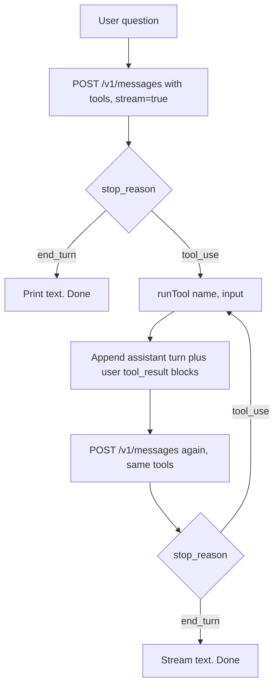
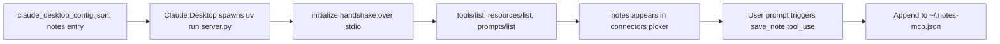

# Project 1 — Anthropic SDK + MCP Exploration

> Branch: `feat/project-1-research` · Last updated: 2026-05-19

## Overview

Six small artifacts, each isolating one concept on the Anthropic API + MCP surfaces. Goal is to understand each primitive in the smallest runnable form before building anything larger — tool definitions, the tool-use roundtrip, streaming, prompt caching, structured outputs, `tool_choice` semantics, and a hand-built stdio MCP server.

## What changed

- `tool-use-demo.ts` — SDK, one API call. Sends a `get_weather` tool definition; prints the model's `tool_use` block. Stops at `stop_reason: "tool_use"` (does not execute the tool).
- `tool-use-roundtrip.ts` — raw `fetch`, no SDK. Same tool, full two-turn loop: model returns `tool_use`, the script executes the (fake) tool, sends `tool_result` back, model produces a natural-language answer. Streams via a hand-rolled SSE parser. `cache_control` on the last tool definition with inline notes on prefix-match rules and the 4096-token cache minimum on Opus 4.7.
- `tool-use-roundtrip-sdk.ts` — SDK equivalent of the above. Uses `client.messages.stream()`, `stream.on("text", …)`, and `stream.finalMessage()`. Same cache placement.
- `structured-json.ts` — JSON output via prompt+schema. Prefill is unsupported on Opus 4.7, so the schema and a worked example live in the system prompt. Parses the response with an `extractJson()` (strips markdown fences) and a `parseFeedback()` that returns `{ok, value} | {ok: false, error, raw}` — covers parse failures, missing keys, wrong types, bad enum values.
- `tool-choice.md` — reference table for `auto` / `any` / `tool` / `none` and how `disable_parallel_tool_use` changes each.
- `note-server/server.py` — minimal stdio MCP server using `FastMCP`. One tool (`save_note(title, body)` → appends to `~/.notes-mcp.json`), one resource (`notes://recent` → last 10 notes). PEP 723 inline-deps header so `uv run --script server.py` works without a venv. Wired into Claude Desktop's `mcpServers` config and verified end-to-end.

## Code flow

### Tool-use roundtrip (`tool-use-roundtrip*.ts`)

1. Build the request: `model`, `max_tokens`, `tools` (with `cache_control` on the last entry), and `messages` containing the user question.
2. Call `POST /v1/messages` with `stream: true`. The raw-fetch version assembles content blocks from SSE events (`content_block_start` → `content_block_delta` → `content_block_stop`); the SDK version delegates that to `client.messages.stream()`.
3. After the stream ends, inspect `stop_reason`. If `"tool_use"`, locate every `tool_use` block in `content`.
4. Append the assistant turn (full `content`, including the `tool_use` blocks) to `messages`.
5. Execute each `tool_use` locally — `runTool(name, input)` returns a string. Build one `tool_result` block per `tool_use` with the matching `tool_use_id`.
6. Append a user turn whose `content` is the array of `tool_result` blocks. Call `/v1/messages` again with the same `tools`.
7. Second response streams text and stops at `stop_reason: "end_turn"`. Print `usage` to inspect cache hits.

### Structured JSON (`structured-json.ts`)

1. Send a single request with a system prompt that names every key, enumerates allowed `sentiment` values, and shows a worked example.
2. Read the first `text` block from `response.content`.
3. `extractJson()` strips ```` ```json ```` fences if present and otherwise grabs the outer `{…}`.
4. `parseFeedback()` runs `JSON.parse`, then validates: `sentiment` ∈ {positive, negative, neutral}, `key_issues` is `string[]`, `action_items` is `{team, task}[]`.
5. Return a discriminated union — caller branches on `result.ok`. On failure the raw response is included for debugging.

### Notes MCP server (`note-server/server.py`)

1. Claude Desktop spawns `uv run --script server.py` per the `claude_desktop_config.json` entry. `uv` resolves the PEP 723 inline-deps header and runs in an isolated env.
2. `FastMCP("notes")` registers the `save_note` tool and `notes://recent` resource via decorators (`@mcp.tool()`, `@mcp.resource(...)`).
3. `mcp.run()` starts stdio transport. Claude Desktop sends `initialize` → `tools/list` → `resources/list` over stdin; server replies on stdout.
4. When the user asks "save a note…", Claude emits a `tool_use` for `save_note`. The server's handler appends to `~/.notes-mcp.json` and returns a confirmation string.
5. When Claude reads `notes://recent`, the handler loads the JSON, reverses, slices to 10, formats as markdown-ish text.

## Flowchart

Tool-use roundtrip — what happens between the user question and the final assistant text:



MCP server registration in Claude Desktop:



## Glossary

- **Tool use** — the API pattern where Claude returns a `tool_use` content block describing a function call the caller should run, then expects a `tool_result` block back on the next turn.
- **`tool_use_id`** — opaque ID on each `tool_use` block; the corresponding `tool_result` must reference it so the model knows which call the result belongs to.
- **`stop_reason`** — top-level field on the response telling you why the model stopped: `end_turn`, `max_tokens`, `tool_use`, `stop_sequence`, `pause_turn`, `refusal`.
- **SSE (Server-Sent Events)** — the transport the Messages API uses when `stream: true`. Plain HTTP with `data: <json>` lines separated by blank lines.
- **`content_block_delta`** — SSE event carrying an incremental update for one content block (a `text_delta` chunk, or a partial JSON fragment for `tool_use` inputs as `input_json_delta`).
- **`cache_control`** — per-block marker (`{type: "ephemeral"}`) that names the end of a cacheable prefix. Render order is `tools` → `system` → `messages`; the marker caches everything up to and including its block.
- **Prefix match** — caching invariant: any byte change anywhere before the marker invalidates the cache. Practically: never put `cache_control` on something that varies per request.
- **Adaptive thinking** — Opus 4.7's only thinking mode. `thinking: {type: "adaptive"}` lets the model decide depth; the fixed `budget_tokens` parameter is removed.
- **Stdio MCP** — Model Context Protocol over stdin/stdout. The host (Claude Desktop) spawns the server as a subprocess; both sides exchange JSON-RPC messages.
- **FastMCP** — high-level Python class in the `mcp` SDK. Wraps the JSON-RPC plumbing so you declare tools/resources/prompts with decorators.
- **PEP 723 inline deps** — `# /// script` header in a single-file Python script declaring `dependencies`. `uv run --script path.py` reads it and runs in an isolated env without a `pyproject.toml` or venv.

## API reference

### TypeScript

| Symbol | File | Purpose |
| --- | --- | --- |
| `runTool(name, input)` | `tool-use-roundtrip.ts`, `tool-use-roundtrip-sdk.ts`, `tool-use-demo.ts` (variants) | Fake tool executor — returns a canned weather string for `get_weather`. |
| `streamClaude(messages)` | `tool-use-roundtrip.ts` | Raw-fetch SSE parser. Returns `{content, stop_reason, usage}` assembled from `message_start` / `content_block_*` / `message_delta` events. |
| `extractJson(raw)` | `structured-json.ts` | Strips markdown fences; falls back to the outer `{…}` substring. Returns `string \| null`. |
| `parseFeedback(raw)` | `structured-json.ts` | Discriminated union: `{ok: true, value: Feedback} \| {ok: false, error, raw}`. |
| `callClaude(userText)` | `structured-json.ts` | Single non-streaming `POST /v1/messages` call with the JSON-mode system prompt. |

### Python (MCP)

| Symbol | File | Purpose |
| --- | --- | --- |
| `save_note(title, body)` | `note-server/server.py` | `@mcp.tool()` — appends `{title, body, created_at}` to `~/.notes-mcp.json`. Returns a confirmation string. |
| `recent_notes()` | `note-server/server.py` | `@mcp.resource("notes://recent")` — returns the last 10 notes formatted as markdown-ish text. |
| `_load()` / `_save(notes)` | `note-server/server.py` | Tolerant JSON read/write helpers (empty list on missing file or parse error). |
