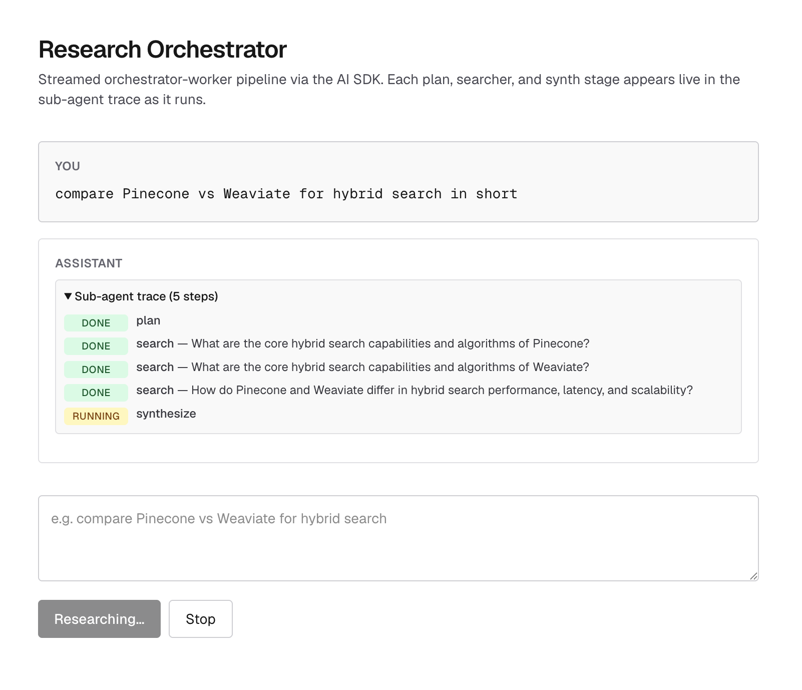
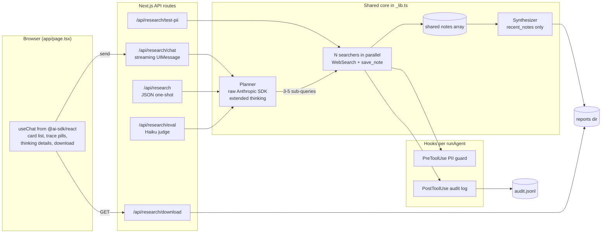

# Project 1 — Multi-agent research orchestrator

A Next.js + TypeScript demo of the **orchestrator-workers** workflow from Anthropic's *Building effective agents*: a planner decomposes a research question into sub-queries, parallel searcher sub-agents gather facts via `WebSearch` into an in-process MCP notes store, and a synthesizer sub-agent writes a one-page markdown report. Streamed end-to-end into a `useChat` UI with live sub-agent trace pills, the planner's extended-thinking block, and a Download-report button. Built as Project 1 of the CCA-F exam prep, exercising agentic architecture, MCP, hooks, evals, and streaming UI in one repo.

## Screenshot

<!-- Capture localhost:3000 mid-research: trace panel open with mixed running/done pills,
     the amber "Planner's extended thinking" details visible, and the report streaming in.
     Save the PNG at docs/screenshot.png and this placeholder will resolve. -->




## Architecture



All four request-driven entrypoints (`/api/research/chat`, `/api/research`, `/api/research/eval`, `/api/research/test-pii`) share the same `runResearch()` function in `app/api/research/_lib.ts`. The only differences between them are the **profile** (`PROD_PROFILE` = Sonnet/Opus, `FAST_PROFILE` = Haiku-everywhere with capped turns) and what they emit — JSON, streamed UIMessage parts, or judge scores. `runResearch` itself runs the planner via the raw `@anthropic-ai/sdk` (one tool-less call, no point spawning a CLI subprocess), then fans out searcher sub-agents via the Claude Agent SDK with a fresh in-process MCP server per `query()` call (the underlying `McpServer` instance isn't re-entrant across concurrent connections — every server closes over the same `notes` array so the shared writeboard semantics survive), then runs the synthesizer.

## Backend, in execution order

This walks the chat path — `POST /api/research/chat` — top to bottom, with the real code at each step. The JSON and eval routes use the same `runResearch` core; only the way they emit results differs.

### 1. The chat endpoint opens a UIMessage stream

`app/api/research/chat/route.ts`:

```ts
const stream = createUIMessageStream({
  execute: async ({ writer }) => {
    // ... emit synthetic tool-call parts for each pipeline stage,
    // a reasoning part for the planner's thinking, and the report as text ...
  },
});
return createUIMessageStreamResponse({ stream });
```

`createUIMessageStream` + `createUIMessageStreamResponse` are the v6 AI SDK primitives that produce a Server-Sent-Events stream the client's `useChat` consumes. The `writer` is the only handle the endpoint needs — we don't manage the `Response` body directly.

### 2. Lifecycle callbacks turn pipeline stages into wire chunks

Before calling `runResearch`, the endpoint stitches its event callbacks to the writer:

```ts
const planId = "plan-1";
const synthId = "synth-1";
const searcherIds: Record<number, string> = {};

const result = await runResearch(query, FAST_PROFILE, {
  onPlanStart: () => {
    writer.write({ type: "tool-input-start", toolCallId: planId, toolName: "plan" });
    writer.write({ type: "tool-input-available", toolCallId: planId, toolName: "plan", input: { query } });
  },
  onPlanDone: (subQueries, thinking) => {
    writer.write({ type: "tool-output-available", toolCallId: planId, output: { sub_queries: subQueries } });
    if (thinking) {
      writer.write({ type: "reasoning-start", id: "plan-thinking" });
      writer.write({ type: "reasoning-delta", id: "plan-thinking", delta: thinking });
      writer.write({ type: "reasoning-end", id: "plan-thinking" });
    }
  },
  onSearcherStart: (sq, i) => {
    const id = `search-${i}`;
    searcherIds[i] = id;
    writer.write({ type: "tool-input-start", toolCallId: id, toolName: "search" });
    writer.write({ type: "tool-input-available", toolCallId: id, toolName: "search", input: { sub_query: sq, index: i } });
  },
  onSearcherDone: (sq, i, ok) => {
    if (ok) writer.write({ type: "tool-output-available", toolCallId: searcherIds[i], output: { sub_query: sq } });
    else    writer.write({ type: "tool-output-error", toolCallId: searcherIds[i], errorText: "searcher rejected" });
  },
  // onSynthStart / onSynthDone similarly...
});
```

Each pipeline stage becomes a **synthetic tool-call lifecycle** on the wire: `tool-input-start` → `tool-input-available` (state goes "running") → `tool-output-available` / `-error` (state goes "done" or "failed"). The client filters these parts with `isStaticToolUIPart` and reads `part.state` to render pills — no client-side state machine needed. The planner's thinking is emitted as `reasoning-*` chunks so the UI renders it as a `ReasoningUIPart` in a collapsed `<details>`.

### 3. `runResearch` orchestrates the three stages

`app/api/research/_lib.ts`:

```ts
export async function runResearch(userQuery, profile = PROD_PROFILE, events?: RunResearchEvents): Promise<ResearchResult> {
  const notes: Note[] = [];
  events?.onPlanStart?.();
  const { subQueries, thinking: planThinking } = await makePlan(userQuery, profile);
  events?.onPlanDone?.(subQueries, planThinking);

  const searcher = searcherAgent(profile);
  // Wrap each searcher so onSearcherStart/Done fire per-sub-query, not per-batch.
  const searcherResults = await Promise.allSettled(
    subQueries.map(async (sq, i) => {
      events?.onSearcherStart?.(sq, i);
      try {
        const r = await runAgent(/* searcher prompt */, searcher, notes);
        events?.onSearcherDone?.(sq, i, true, r.text);
        return r;
      } catch (err) {
        events?.onSearcherDone?.(sq, i, false, null);
        throw err;
      }
    }),
  );

  if (notes.length === 0) return { /* empty-notes return */ };

  events?.onSynthStart?.();
  const synth = await runAgent(synthPrompt, synthesizerAgent(profile), notes);
  events?.onSynthDone?.(synth.text.length);
  return { /* full ResearchResult */ };
}
```

Two things are doing real work here:

- **The `Promise.allSettled` wrapper around each searcher** fires per-searcher callbacks *as each searcher resolves*, not when the whole batch settles. That's why the UI shows three concurrent "running" pills flipping to "done" independently.
- **Failures stay isolated** — one searcher rejecting doesn't poison the run because the others still wrote to the shared `notes` array. The empty-notes guard only triggers when *every* searcher failed.

### 4. The planner uses the raw `@anthropic-ai/sdk`, not the Agent SDK

```ts
async function makePlan(userQuery, profile): Promise<{ subQueries, thinking }> {
  const client = new Anthropic();
  const useThinking = profile.planThinkingBudget > 0;
  const msg = await client.messages.create({
    model: profile.planModel,
    max_tokens: useThinking ? profile.planThinkingBudget + 1024 : 1024,
    ...(useThinking ? { thinking: { type: "enabled", budget_tokens: profile.planThinkingBudget } } : {}),
    system: 'You break a research question into 3-5 ... JSON only: {"sub_queries": ["...", "..."]}',
    messages: [{ role: "user", content: userQuery }],
  });

  // Two content-block types when thinking is on.
  const text     = msg.content.filter((b): b is Anthropic.TextBlock     => b.type === "text").map(b => b.text).join("");
  const thinking = msg.content.filter((b): b is Anthropic.ThinkingBlock => b.type === "thinking").map(b => b.thinking).join("\n\n");

  const match = text.match(/\{[\s\S]*\}/);
  if (!match) throw new Error(`Planner returned no JSON. Raw: ${text}`);
  const raw = (JSON.parse(match[0]) as { sub_queries?: unknown }).sub_queries;
  if (!Array.isArray(raw) || raw.length < 3 || raw.length > 5) throw new Error(/* ... */);

  let subQueries: string[] = raw.map(String);
  if (profile.maxSubQueries) subQueries = subQueries.slice(0, profile.maxSubQueries);
  return { subQueries, thinking };
}
```

One-shot LLM call, no tools, no loop — spawning a Claude Code CLI subprocess (which the Agent SDK does on every `query()`) would be pure overhead. With `thinking` enabled the response carries two content-block types — `thinking` (the reasoning, shown to the UI) and `text` (the JSON answer). `max_tokens` must exceed `budget_tokens` (API constraint, not arbitrary).

### 5. `runAgent` runs each sub-agent with hooks + MCP + bounded retry

```ts
async function runAgentOnce(prompt, agent, notes): Promise<RunAgentResult> {
  // Build a FRESH MCP server per call — the McpServer instance isn't re-entrant
  // across concurrent connections. All servers close over the same `notes`
  // array so the shared writeboard survives.
  const notesServer = buildNotesServer(notes);
  const blocks: PiiBlock[] = [];
  const piiHook = buildPiiHook(blocks);

  const stream = query({
    prompt,
    options: {
      mcpServers: { notes: notesServer },
      agents: { _main: agent },
      agent: "_main",
      tools: ["WebSearch"],
      permissionMode: "bypassPermissions",
      allowDangerouslySkipPermissions: true,
      hooks: {
        PreToolUse:  [{ hooks: [piiHook] }],
        PostToolUse: [{ hooks: [auditWebSearchHook] }],
      },
    },
  });

  for await (const m of stream) {
    if (m.type === "result") {
      if (m.subtype === "success") return { text: m.result, blocks };
      throw new Error(`Sub-agent failed (${m.subtype})`);
    }
  }
  throw new Error("Sub-agent produced no result message");
}

export async function runAgent(prompt, agent, notes, retries = 2): Promise<RunAgentResult> {
  let lastErr: unknown;
  for (let attempt = 0; attempt <= retries; attempt++) {
    try { return await runAgentOnce(prompt, agent, notes); }
    catch (err) {
      lastErr = err;
      if (attempt < retries) await sleep(2 ** attempt * 1000); // 1s, 2s backoff
    }
  }
  throw lastErr instanceof Error ? lastErr : new Error(String(lastErr));
}
```

Five things happen here, in order of importance:

1. **The agent-as-main-thread pattern** (`agents: { _main: agent }, agent: "_main"`) — the `AgentDefinition`'s system prompt + tool allowlist replace Claude Code's defaults for this run. Each searcher and the synthesizer is its own first-class agent, not a Task-tool sub-agent of a parent.
2. **MCP-per-query** — building `notesServer` *inside* the function is load-bearing. The underlying `McpServer` instance isn't re-entrant across concurrent client connections; sharing one across 3-5 parallel searchers left only the first searcher with `mcp__notes__save_note`, and the rest ran toolless. Building one server per call (all closing over the same `notes` array) restores tools everywhere while keeping the shared store.
3. **The hook chain** — `PreToolUse` runs the PII guard (returns `permissionDecision: "deny"` with a redaction reason when email/SSN appears in tool args; the agent reads the reason, redacts, and retries — that's the recovery story). `PostToolUse` runs the audit hook (appends every `WebSearch` call to `audit.jsonl`).
4. **`bypassPermissions` + `allowDangerouslySkipPermissions: true`** — there's no human at the loop server-side. The safety boundary is the `AgentDefinition.tools` allowlist plus the hooks.
5. **Bounded retry with backoff** — under bursty load (parallel searchers + WebSearch quotas + concurrent API calls) transient failures happen. The current retry is naive — it also retries permanent 4xx (see Production additions §1).

### 6. The notes MCP server, in one closure

```ts
export function buildNotesServer(notes: Note[]): McpSdkServerConfigWithInstance {
  return createSdkMcpServer({
    name: "notes",
    version: "1.0.0",
    tools: [
      tool("save_note", "Save a research finding...",
        { title: z.string(), body: z.string(), source_url: z.string().optional(), sub_query: z.string() },
        async (args) => {
          notes.push({ ...args, created_at: new Date().toISOString() });
          return { content: [{ type: "text", text: `Saved '${args.title}' (${notes.length} total).` }] };
        }),
      tool("recent_notes", "Return every note...", {}, async () => {
        if (notes.length === 0) return { content: [{ type: "text", text: "No notes yet." }] };
        const text = [...notes].reverse().map(/* format each */).join("\n\n---\n\n");
        return { content: [{ type: "text", text }] };
      }),
    ],
  });
}
```

The whole trick: tool handlers **close over** the `notes` array. Writes from any handler are visible to every handler that closes over the same array. That's the entire coordination layer between parallel searchers and the synthesizer — no DB, no file, no Redis. Searchers get `save_note` in their allowlist; the synthesizer gets `recent_notes` only — that write-vs-read asymmetry is governance encoded in tool gating, not in code.

### 7. After `runResearch` returns: save + emit the report

Back in the chat endpoint:

```ts
if (result.report) {
  const filepath = await saveReport(query, result.report, result.subQueries);
  const filename = path.basename(filepath);
  writer.write({
    type: "tool-output-available",
    toolCallId: synthId,
    output: { report_chars: result.report.length, filename },
  });
  writer.write({ type: "text-start", id: textId });
  writer.write({ type: "text-delta", id: textId, delta: result.report });
  writer.write({ type: "text-end", id: textId });
}
```

The synth tool's `tool-output-available` is deferred until *after* `saveReport` runs, so the chunk can carry the filename. The client picks that up from the synth `ToolUIPart`'s output to render the Download button. The report itself goes out as a single `text-delta` — we don't have intermediate text to stream, since the synthesizer returns the entire report at once.

### What the UI does with it

`app/page.tsx` is a thin reader of `message.parts` — it filters by part type and renders three independent surfaces:

```tsx
const textParts      = message.parts.filter(isTextUIPart);
const toolParts      = message.parts.filter(isStaticToolUIPart);    // trace pills
const reasoningParts = message.parts.filter(isReasoningUIPart);     // thinking <details>

const synthPart = toolParts.find(p => getToolName(p) === "synthesize" && p.state === "output-available");
const filename = synthPart && /* ... */ ? String((synthPart.output as { filename }).filename) : null;
```

Three different UIMessage part kinds expressing three different signals — `tool-*` for sub-agent lifecycle (the pills), `reasoning-*` for the planner's thinking, `text-*` for the final answer. The pills' state animation (running → done/failed) is driven entirely by `part.state` — the SDK reconciles streaming chunks into part objects for us. The Download button only renders once it can read a `filename` field from the synth tool's output, so it appears at exactly the moment the report has been persisted.

## Trade-offs: orchestrator-workers vs single agent with tools

The exam phrases this question as "given this scenario, which choice is most correct?" — the right answer depends on whether the sub-tasks are independent.

| | Single agent with tools | Orchestrator-workers (this project) |
|---|---|---|
| **Shape** | One conversation, all tools, one loop until done | Planner → N parallel workers → synthesizer |
| **Wall-clock latency** | Linear in #tool calls (serial) | Bounded by slowest worker (parallel) |
| **Base cost** | One model spinning up; cheap floor | N+2 model invocations even on trivial queries; higher floor |
| **Prompt design** | Single system prompt has to handle every role | Per-role prompts; tool gating per agent |
| **Context isolation** | All tool results pile into one context — bloat, signal loss | Each worker has its own context; signal stays high |
| **Failure modes** | One mis-step poisons the shared context | Failures isolated per worker (`allSettled` keeps the rest alive) |
| **Debugging** | Single conversation trace | Multiple subprocesses; cross-process correlation needed |
| **New failure modes** | — | Coordination bugs (e.g. our MCP-per-query: shared `McpServer` instance not re-entrant under concurrent connections — only the first worker got tools) |

**Rule of thumb:**
- **Single agent with tools** when sub-tasks are *sequential and dependent* (each step needs the previous output). Cheaper, simpler, easier to debug.
- **Orchestrator-workers** when sub-tasks are *independent and parallelisable*. Research is the canonical fit: 5 sub-queries about Pinecone vs Weaviate don't depend on each other, so running them in parallel cuts wall-clock by ~5× and lets you give each worker a narrower role + tighter tool allowlist.

## How to run locally

**Prereqs:** Node ≥ 20, an Anthropic API key with credit.

**1. Env.** Put the key in the repo-root `.env` (one level above this directory — that path is intentional so the same key is shared with future projects):
```
ANTHROPIC_API_KEY=sk-ant-...
```
Watch the variable name — `AMTHROPIC_API_KEY` will silently fail (the SDK can't find it, you'll see *"Could not resolve authentication method"*).

**2. Install + start the dev server.** From `project-1-research/`:
```bash
npm install
set -a; source ../.env; set +a   # export the key into THIS shell
npm run dev
```
Open <http://localhost:3000>, type a research query, hit **Send**. The first run will spawn 3 Haiku searcher subprocesses (FAST profile) + a Haiku synth + a planner call. Expect ~1-2 minutes for a full response, ~$0.10-$0.30.

**3. Or hit the JSON / eval / test routes directly:**
```bash
# Full Sonnet/Opus orchestration (slower, better quality):
curl -X POST localhost:3000/api/research \
  -H 'Content-Type: application/json' \
  -d '{"query":"compare Pinecone vs Weaviate for hybrid search"}'

# Run the eval harness across the 5-item set:
curl -X POST localhost:3000/api/research/eval -d '{}' | jq .

# Verify the PII PreToolUse hook end-to-end:
curl -X POST localhost:3000/api/research/test-pii | jq '.verdict'
```

## API surface

| Method | Route | Purpose |
|---|---|---|
| POST | `/api/research` | One-shot JSON. Runs `runResearch` on the **PROD** profile (Sonnet searchers, Opus synth, extended thinking on the planner). Returns the full payload (sub-queries, notes, report, report_path, pii_blocks). |
| POST | `/api/research/chat` | Streaming UIMessage endpoint consumed by `useChat`. Runs on the **FAST** profile (Haiku). Emits `tool-*` parts per pipeline stage, `reasoning-*` for the planner's thinking, and the report as `text-*`. |
| POST | `/api/research/eval` | Loops `evals/research-evals.json` items through `runResearch` (FAST profile), runs a Haiku LLM-judge against each report's criteria, returns per-criterion pass/fail + aggregate score. Accepts `{ ids: number[] }` to run a subset. |
| POST | `/api/research/test-pii` | Single-agent reproduction of the PII hook: prompts an agent to save a PII-laden note, asserts the hook denies + the agent recovers with `[REDACTED]`. |
| GET | `/api/research/download/[id]` | Serves a saved markdown report by filename. Validates the id against `^[A-Za-z0-9-]+\.md$` + resolves the path inside `REPORTS_DIR` (path-traversal defense). |

## Eval / quality bar

The eval set is at `evals/research-evals.json` — five diverse research queries (2 comparisons, 1 explanatory, 1 risk analysis, 1 technical), each with 5 shared structural criteria (executive summary, ≥3 headings, inline citations, Sources section, ~1-page length) plus 2 content-specific criteria. An item passes only if a Haiku judge confirms **every** criterion is satisfied. Target: **≥ 4/5 items pass**.

Most recent cheap-profile run: **3/5**. Two of the failures were **not** criteria misses — they were infra failures (the account ran out of credits mid-run, surfaced as "all searchers failed" + a credit-balance error string). The three that ran cleanly all passed every criterion. The lesson the loop is meant to teach: **read the failure shape before changing anything** — `passed:false` with non-empty `fails: [...]` means tune the prompt; `passed:false` with non-null `error: "..."` means fix infra (credits, env, retry policy). Same score, opposite fixes.

How to drive the iterate loop yourself:
```bash
# Full set, then summary view:
curl -s -X POST localhost:3000/api/research/eval -d '{}' \
| jq '{pass_rate, results: [.results[] | {id, passed, error, fails: [.criteria[]? | select(.pass==false) | .criterion]}]}'

# Re-run only the ids that failed:
curl -s -X POST localhost:3000/api/research/eval -d '{"ids":[2,4]}' | jq .
```

Knobs you tune (in `_lib.ts`): `SEARCHER_PROMPT`, `SYNTHESIZER_PROMPT`, `FAST_PROFILE` (models, `searcherMaxTurns`, `maxSubQueries`). Add or revise queries in `evals/research-evals.json`.

## What I'd add for production

In rough order of impact:

1. **Smarter retry** — the current bounded retry in `runAgent` retries any thrown error 3×. It should classify: retry transient codes (429, 529, 5xx, network) with exponential backoff + jitter, **fail fast** on permanent ones (400 `invalid_request`, 401, 403). Today, hitting a credit-balance 400 burns 3 retries for no reason.
2. **Durable storage** — `reports/` and `audit.jsonl` live on the local filesystem. Production wants S3 (reports) + a real append-only log (audit) keyed by request/user. The current setup loses everything when the container restarts.
3. **AuthN/Z + per-user budgets** — the routes are unauthenticated and have no rate limit. A real deployment needs an API key, a request rate limit, and a per-user cost ceiling that halts mid-run when crossed (each run is genuinely measurable LLM spend).
4. **Prompt caching breakpoints** — every searcher rebuilds the same long system prompt from scratch. Adding `cache_control` breakpoints between the static system prompt and the per-call sub-query would slash input-token cost. (Day-12 territory on the prep plan but cheap to apply here.)
5. **Observability with trace IDs** — propagate a `traceId` through the orchestrator → searchers → audit log so a single research request is reconstructible from `audit.jsonl` after the fact. Today, audit lines have a `ts` and a `tool_use_id` but no thread back to the parent run.
6. **Eval as a CI gate** — wire the eval route to a GitHub Actions job that runs on PRs against the orchestrator code; block merges that drop pass-rate below threshold. Prevents prompt drift.
7. **PII detector beyond regex** — the current `findPii` only catches email and US-SSN patterns. Production wants named-entity recognition (or a small LLM classifier) to catch names, addresses, phone numbers, EU national IDs, etc. Regex is a starting point, not a finished safeguard.
8. **Per-sub-query model selection** — `FAST_PROFILE` locks one model for all searchers. For mixed-complexity research, route easy sub-queries (definitions, lookups) to Haiku and complex ones (synthesis-during-search) to Sonnet. The plan step already has the sub-queries; it can emit a per-sub-query difficulty estimate.

## Deeper walkthrough

The code walkthrough — function-by-function in execution order, with the actual code blocks, glossary, and API reference — lives at [`docs/orchestrator-route.md`](docs/orchestrator-route.md). Use that when you want the *why each line does what it does*; this README is the design + portfolio view.
