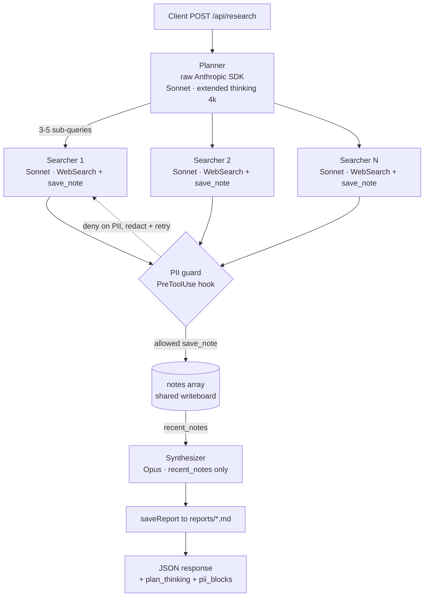

# Research Orchestrator (`/api/research`)

> Branch: `feat/project-1-research` · Last updated: 2026-05-27

## Overview

A `POST` endpoint that turns a research question into a written report via a three-stage orchestrator-worker pipeline: a **planner** (with extended thinking) generates 3–5 sub-queries, one **searcher** sub-agent per sub-query runs in parallel using `WebSearch` and an in-process `notes` MCP server, and a final **synthesizer** sub-agent writes the report from the gathered notes. The report is saved to disk as a `.md` file and returned in the response. A **PreToolUse hook** blocks any tool call whose arguments contain PII (email / SSN), and the agent recovers by redacting and retrying.

The pattern matches the *orchestrator-workers* workflow from Anthropic's [Building effective agents](https://www.anthropic.com/research/building-effective-agents) post — one of the canonical multi-agent patterns the CCA-F exam tests.

## What changed

- `app/api/research/route.ts` — the orchestrator: `makePlan` (extended thinking), agent definitions, `saveReport`, and the `POST` flow.
- `app/api/research/_lib.ts` — shared, non-routable helpers: the `Note` type, `buildNotesServer`, the PII detector + hook (`findPii`, `buildPiiHook`), and the `runAgent` sub-agent harness.
- `app/api/research/test-pii/route.ts` — verification route that drives a single sub-agent into a PII block and checks it recovers.
- `app/page.tsx` — minimal client UI: query form, collapsed extended-thinking `<details>`, searcher status pills, report view.
- `.gitignore` — ignores generated `reports/`.
- `tsconfig.json` — excludes `_legacy/` from typecheck so the prior standalone scripts don't bleed into Next.js compilation.

## Request lifecycle (at a glance)

A `POST /api/research` with `{ "query": "..." }` runs:

1. **Parse + validate** the body (`route.ts:115`) → `400` on bad input.
2. **Allocate** a per-request `notes: Note[]` array (`route.ts:130`) — the shared writeboard.
3. **Plan** with extended thinking (`makePlan`, `route.ts:13`) → 3–5 sub-queries + the planner's reasoning.
4. **Fan out** one searcher per sub-query in parallel (`route.ts:135`), each writing into `notes`.
5. **Guard**: every searcher tool call passes the PII `PreToolUse` hook first.
6. **Empty-notes guard** (`route.ts:166`) → `502` if all searchers failed.
7. **Synthesize** the report from `notes` (`route.ts:186`).
8. **Save** to `reports/*.md` (`route.ts:189`) and **return** the JSON payload (`route.ts:191`).

The sections below walk the actual code, file by file, in dependency order.

## Code walkthrough — `_lib.ts` (shared infrastructure)

Everything the sub-agents need lives here so both `route.ts` and `test-pii/route.ts` import it. The `_` prefix keeps the file out of Next.js routing.

### The `Note` type — the shape of one finding

```ts
export type Note = {
  title: string;
  body: string;
  source_url?: string;
  sub_query: string; // which sub-query this note was gathered for
  created_at: string;
};
```

A `Note[]` is the only state the pipeline shares between agents. `sub_query` tags each note with its origin so the synthesizer (and the UI) can attribute findings.

### `buildNotesServer` — the in-process MCP server

```ts
export function buildNotesServer(notes: Note[]): McpSdkServerConfigWithInstance {
  return createSdkMcpServer({
    name: "notes",
    version: "1.0.0",
    tools: [
      tool(
        "save_note",
        "Save a research finding as a note. Use one note per discrete fact, quote, or data point.",
        { title: z.string(), body: z.string(), source_url: z.string().optional(), sub_query: z.string() },
        async (args) => {
          notes.push({ ...args, created_at: new Date().toISOString() });
          return { content: [{ type: "text", text: `Saved '${args.title}' (${notes.length} total).` }] };
        },
      ),
      tool("recent_notes", "Return every note gathered so far, newest first.", {}, async () => {
        if (notes.length === 0) return { content: [{ type: "text", text: "No notes yet." }] };
        const text = [...notes].reverse().map((n) => `# ${n.title}\n...\n\n${n.body}`).join("\n\n---\n\n");
        return { content: [{ type: "text", text }] };
      }),
    ],
  });
}
```

The whole trick is the **closure over the `notes` parameter**. `createSdkMcpServer` exposes two tools the model sees as `mcp__notes__save_note` and `mcp__notes__recent_notes`. Their handlers mutate / read the exact array passed in — so whoever holds a reference to that array sees every write. No database, no file, no IPC. The Zod schema (3rd arg to `tool`) becomes the tool's input schema the model must satisfy.

### `findPii` — recursive PII scanner

```ts
const PII_PATTERNS: { name: string; regex: RegExp }[] = [
  { name: "email", regex: /[A-Za-z0-9._%+-]+@[A-Za-z0-9.-]+\.[A-Za-z]{2,}/ },
  { name: "ssn", regex: /\b\d{3}-\d{2}-\d{4}\b/ },
];

export function findPii(value: unknown): string | null {
  if (value == null) return null;
  if (typeof value === "string") {
    for (const { name, regex } of PII_PATTERNS) if (regex.test(value)) return name;
    return null;
  }
  if (Array.isArray(value)) {
    for (const v of value) { const r = findPii(v); if (r) return r; }
    return null;
  }
  if (typeof value === "object") {
    for (const v of Object.values(value as Record<string, unknown>)) { const r = findPii(v); if (r) return r; }
  }
  return null;
}
```

Tool inputs are arbitrary JSON, so the scan **recurses** through strings, arrays, and objects. It returns the *name* of the first matching pattern (`"email"` / `"ssn"`) or `null`. First-match-wins is why a body containing both an email and an SSN reports only `"email"` — the agent still redacts both because it sees the deny reason (below).

### `buildPiiHook` — the `PreToolUse` hook factory

```ts
export function buildPiiHook(blocks: PiiBlock[]): HookCallback {
  return async (input) => {
    if (input.hook_event_name !== "PreToolUse") return {};      // ignore other events
    const hit = findPii(input.tool_input);
    if (!hit) return {};                                        // {} == allow
    const reason = `[PII guard] Tool call to '${input.tool_name}' blocked: arguments contain a ${hit} pattern. Rewrite the arguments with the PII redacted (e.g. replace with [REDACTED]) and try again.`;
    blocks.push({ tool_name: input.tool_name, pattern: hit, reason }); // record for the caller
    return {
      hookSpecificOutput: {
        hookEventName: "PreToolUse",
        permissionDecision: "deny",
        permissionDecisionReason: reason,
      },
    };
  };
}
```

A *factory* rather than a bare hook: it closes over a `blocks` array the caller owns, so denials are observable without parsing SDK message internals. Returning `{}` means "no opinion, allow". Returning `permissionDecision: "deny"` blocks the call, and `permissionDecisionReason` is fed back to the model — that text is what enables graceful recovery: the agent reads it, redacts, and retries.

### `runAgent` — the sub-agent harness

```ts
export async function runAgent(prompt: string, agent: AgentDefinition, notes: Note[]): Promise<RunAgentResult> {
  const notesServer = buildNotesServer(notes); // fresh server per call (see below)
  const blocks: PiiBlock[] = [];
  const piiHook = buildPiiHook(blocks);

  const stream = query({
    prompt,
    options: {
      mcpServers: { notes: notesServer },
      agents: { _main: agent },
      agent: "_main",
      tools: ["WebSearch"],
      permissionMode: "bypassPermissions",
      allowDangerouslySkipPermissions: true,
      hooks: { PreToolUse: [{ hooks: [piiHook] }] },
    },
  });

  for await (const m of stream) {
    if (m.type === "result") {
      if (m.subtype === "success") return { text: m.result, blocks };
      throw new Error(`Sub-agent failed (${m.subtype})`);
    }
  }
  throw new Error("Sub-agent produced no result message");
}
```

This single function runs *every* sub-agent (searchers and synthesizer). Line by line:

- **`buildNotesServer(notes)` inside the function** — the MCP-per-query fix. The underlying `McpServer` instance isn't re-entrant across concurrent connections; sharing one across 5 parallel `query()` calls left only the first searcher with the `notes` tools. A fresh server per call — all closing over the same `notes` array — restores tool access everywhere while keeping the shared writeboard.
- **`agents: { _main: agent }` + `agent: "_main"`** — the agent-as-main-thread pattern. The `AgentDefinition`'s `prompt` becomes the system prompt and its `tools` array becomes the allowlist for this run.
- **`permissionMode: "bypassPermissions"` (+ `allowDangerouslySkipPermissions`)** — no human to approve tools server-side; safety comes from the `tools` allowlist plus the PII hook.
- **`hooks: { PreToolUse: [...] }`** — wires the per-run hook so denials land in this run's `blocks`.
- **The `for await` loop** — `query()` returns an async stream of messages; we wait for the terminal `result` message and return its text plus the collected `blocks`. A non-`success` subtype throws (caught by the orchestrator's try/catch).

## Code walkthrough — `route.ts` (the orchestrator)

### `makePlan` — planner with extended thinking

```ts
const PLAN_THINKING_BUDGET = 4000;

async function makePlan(userQuery: string): Promise<{ subQueries: string[]; thinking: string }> {
  const client = new Anthropic();
  const msg = await client.messages.create({
    model: "claude-sonnet-4-6",
    max_tokens: PLAN_THINKING_BUDGET + 1024,                       // must exceed budget_tokens
    thinking: { type: "enabled", budget_tokens: PLAN_THINKING_BUDGET },
    system: 'You break a research question into 3-5 ... Respond with JSON only: {"sub_queries": [...]}',
    messages: [{ role: "user", content: userQuery }],
  });

  const text = msg.content.filter((b): b is Anthropic.TextBlock => b.type === "text").map((b) => b.text).join("");
  const thinking = msg.content.filter((b): b is Anthropic.ThinkingBlock => b.type === "thinking").map((b) => b.thinking).join("\n\n");

  const match = text.match(/\{[\s\S]*\}/);                          // first {...} in the answer
  if (!match) throw new Error(`Planner returned no JSON. Raw: ${text}`);
  const subQueries = (JSON.parse(match[0]) as { sub_queries?: unknown }).sub_queries;
  if (!Array.isArray(subQueries) || subQueries.length < 3 || subQueries.length > 5) {
    throw new Error(`Planner returned ${Array.isArray(subQueries) ? subQueries.length : 0} sub-queries; expected 3-5`);
  }
  return { subQueries: subQueries.map(String), thinking };
}
```

Uses the **raw `@anthropic-ai/sdk`**, not the Agent SDK — this is one tool-less call, so spawning a CLI subprocess would be pure overhead. With `thinking` enabled the response has two block types: `thinking` (the reasoning, surfaced to the UI) and `text` (the JSON answer). `max_tokens` must exceed `budget_tokens` or the API rejects the request. The plan is validated to 3–5 items so a malformed plan fails fast rather than confusing the searchers.

### Agent definitions — roles encoded as data

```ts
const SEARCHER_AGENT: AgentDefinition = {
  description: "Researches one sub-query via WebSearch and saves findings as notes.",
  prompt: `You are a research searcher. ... call mcp__notes__save_note with title/body/source_url/sub_query ...`,
  tools: ["WebSearch", "mcp__notes__save_note"], // can search + write, cannot read
  mcpServers: ["notes"],
  model: "sonnet",
};

const SYNTHESIZER_AGENT: AgentDefinition = {
  description: "Reads all gathered notes and writes the final research report.",
  prompt: `You are a research synthesizer. Call mcp__notes__recent_notes once ... write a ~1-page report ...`,
  tools: ["mcp__notes__recent_notes"],          // read-only, no web, no writes
  model: "opus",
};
```

The `tools` arrays *are* the governance: searchers can write but not read each other's notes (isolation); the synthesizer can only read (no web, no mutation). Model choice follows cheapest-that-meets-the-bar — `sonnet` for many parallel searches, `opus` for the one report the user actually reads.

### `saveReport` — persist the markdown

```ts
async function saveReport(userQuery: string, report: string, subQueries: string[]): Promise<string> {
  await fs.mkdir(REPORTS_DIR, { recursive: true });
  const stamp = new Date().toISOString().replace(/[:.]/g, "-");
  const filepath = path.join(REPORTS_DIR, `${stamp}-${slugify(userQuery)}.md`);
  const header = `# ${userQuery}\n\n*Generated: ${new Date().toISOString()}*\n\n**Sub-queries covered:**\n${subQueries.map((q, i) => `${i + 1}. ${q}`).join("\n")}\n\n---\n\n`;
  await fs.writeFile(filepath, header + report, "utf8");
  return filepath;
}
```

Prepends a metadata header (query, timestamp, sub-queries) to the synthesizer's markdown and writes it under `reports/` (gitignored). Returns the path so the response can point at it.

### `POST` — the orchestration itself

```ts
const notes: Note[] = [];                                  // shared writeboard for this request
try {
  const { subQueries, thinking: plan_thinking } = await makePlan(userQuery);

  // FAN OUT: one searcher per sub-query, in parallel, failures isolated
  const searcherResults = await Promise.allSettled(
    subQueries.map((sq) =>
      runAgent(`Sub-query: ${sq}\n\nOverall research question (for context only): ${userQuery}`, SEARCHER_AGENT, notes),
    ),
  );

  const allBlocks: PiiBlock[] = [];
  const searcher_summaries = searcherResults.map((r, i) =>
    r.status === "fulfilled"
      ? (allBlocks.push(...r.value.blocks), { sub_query: subQueries[i], status: r.status, summary: r.value.text, blocks: r.value.blocks, error: null })
      : { sub_query: subQueries[i], status: r.status, summary: null, blocks: [], error: String(r.reason) },
  );

  if (notes.length === 0) return Response.json({ error: "All searchers failed; ...", ... }, { status: 502 });

  // SYNTHESIZE from whatever notes survived, then SAVE
  const synth = await runAgent(synthPrompt, SYNTHESIZER_AGENT, notes);
  allBlocks.push(...synth.blocks);
  const report_path = await saveReport(userQuery, synth.text, subQueries);

  return Response.json({ query: userQuery, sub_queries: subQueries, plan_thinking, searcher_summaries, notes, report: synth.text, report_path, pii_blocks: allBlocks });
} catch (err) {
  console.error("[/api/research] failed", err);
  return Response.json({ error: err instanceof Error ? err.message : String(err) }, { status: 500 });
}
```

Note `Promise.allSettled` (not `Promise.all`) — one searcher's rate-limit or `WebSearch` failure rejects only that promise; the rest keep going and the synthesizer works from whatever notes landed. Every `runAgent` shares the same `notes` array, which is how the parallel searchers and the synthesizer communicate. The top-level `try/catch` turns any thrown error (bad plan, synth failure) into a clean `500`.

## Code walkthrough — `test-pii/route.ts` (hook verification)

```ts
const TEST_AGENT: AgentDefinition = {
  description: "Tests the PreToolUse PII guard ...",
  prompt: `... 1. attempt save_note with the raw PII content (will be blocked). 2. read the deny reason. 3. retry with PII replaced by [REDACTED]. 4. summarize.`,
  tools: ["mcp__notes__save_note"],   // no WebSearch — cheap + deterministic
  model: "sonnet",
};

export async function POST() {
  const notes: Note[] = [];
  const result = await runAgent(`Save a note ... ${TEST_BODY_WITH_PII} ...`, TEST_AGENT, notes);
  return Response.json({
    hook_fired: result.blocks.length > 0,
    blocks: result.blocks,
    agent_reply: result.text,
    notes_saved: notes,
    verdict: result.blocks.length > 0 && notes.length > 0
      ? "PASS: hook blocked the PII call, agent recovered and saved a redacted note."
      : "...",
  });
}
```

A self-contained reproduction: a one-tool agent is told to save a note whose body contains an email + SSN. The hook denies the first attempt (`blocks` gets an entry), the agent reads the reason and retries with `[REDACTED]`, and the final `notes` array holds the sanitized note. `verdict` asserts both happened — `PASS` means block *and* recovery. No `WebSearch`, so it runs in ~15s for a few cents.

## Code walkthrough — `app/page.tsx` (the UI)

A `"use client"` component. The submit handler POSTs and stores the response:

```tsx
async function submit(e: React.FormEvent) {
  e.preventDefault();
  setLoading(true); setError(null); setResult(null);
  const res = await fetch("/api/research", {
    method: "POST",
    headers: { "Content-Type": "application/json" },
    body: JSON.stringify({ query }),
  });
  const data = await res.json();
  res.ok ? setResult(data) : setError(data.error ?? `HTTP ${res.status}`);
  setLoading(false);
}
```

The exam-relevant bit is rendering the extended-thinking blocks in a collapsed `<details>` so the planner's reasoning is inspectable without dominating the page:

```tsx
{result.plan_thinking && (
  <details>
    <summary>Planner's extended thinking ({result.plan_thinking.length.toLocaleString()} chars)</summary>
    <pre className="max-h-96 overflow-auto whitespace-pre-wrap">{result.plan_thinking}</pre>
  </details>
)}
```

Below it, the sub-queries list, the searcher status pills (green/red from `searcher_summaries[].status`), and the report render as plain markdown text in a `<pre>`.

## Flowchart



## Glossary

- **Orchestrator-worker** — Multi-agent workflow pattern from *Building effective agents* where a central agent decomposes a task and dispatches subtasks to specialized workers in parallel. Contrasts with single-agent-with-tools (one loop, one model) and with simple *routing* (one input chooses one of N agents, not all of them).
- **Sub-agent** — In the Claude Agent SDK, an `AgentDefinition` that runs as its own conversation with its own system prompt, tool allowlist, and model. Invokable as the main thread (this code) or via the Task tool from a parent agent.
- **In-process MCP server** — An MCP server created with `createSdkMcpServer` whose tool handlers run inside the host Node.js process — no subprocess, no JSON-RPC over stdio. Tools appear to the model under the `mcp__<server>__<tool>` namespace. Cheap to call, but does not support MCP *resources* (only tools). Not re-entrant across concurrent `query()` connections — build one per call.
- **Extended thinking** — A model capability (Sonnet 4.5+/Opus) that produces internal reasoning `thinking` content blocks before the final answer, controlled by `thinking: { type: "enabled", budget_tokens: N }`. `max_tokens` must exceed `budget_tokens`. Used on the planner so the sub-query decomposition reasoning is visible.
- **PreToolUse hook** — A hook that fires *before* a tool executes, receiving `{ tool_name, tool_input, tool_use_id }`. It can allow, deny, or rewrite the call by returning a `permissionDecision`. Here it denies calls carrying PII. (Other Claude Code hook events: PostToolUse, UserPromptSubmit, Notification, Stop, SubagentStop, PreCompact, SessionStart, SessionEnd.)
- **`permissionDecision`** — Field on a PreToolUse hook's `hookSpecificOutput`: `'allow' | 'deny' | 'ask' | 'defer'`. Paired with `permissionDecisionReason`, which is fed back to the model — the reason is what lets the agent recover gracefully (read the deny, redact, retry).
- **Tool gating** — Restricting which tools an agent can call via the `AgentDefinition.tools` array. Acts as a safety boundary alongside the PII hook when `permissionMode` is `bypassPermissions`.
- **`permissionMode: "bypassPermissions"`** — Skips all interactive tool-permission prompts. Required for server-side automation. Must be paired with `allowDangerouslySkipPermissions: true` as an explicit acknowledgement.
- **`Promise.allSettled`** — JavaScript primitive that waits for every promise to either fulfill or reject and reports all outcomes (unlike `Promise.all`, which short-circuits on the first rejection). Used here so one searcher's failure does not kill the whole research run.

## API reference

| Symbol | File | Purpose |
| --- | --- | --- |
| `POST` | `app/api/research/route.ts:115` | Orchestrator entry point. Validates input, plans → fans out → synthesizes → saves, returns JSON. |
| `makePlan(userQuery)` | `app/api/research/route.ts:13` | Sonnet call with extended thinking (`budget_tokens: 4000`); returns `{ subQueries: string[], thinking: string }`. |
| `saveReport(userQuery, report, subQueries)` | `app/api/research/route.ts:92` | Writes the report + metadata header to `reports/<timestamp>-<slug>.md`; returns the path. |
| `SEARCHER_AGENT` | `app/api/research/route.ts:50` | `AgentDefinition` for the per-sub-query searcher. Tools: `WebSearch`, `mcp__notes__save_note`. Model: `sonnet`. |
| `SYNTHESIZER_AGENT` | `app/api/research/route.ts:67` | `AgentDefinition` for the final report writer. Tools: `mcp__notes__recent_notes`. Model: `opus`. |
| `runAgent(prompt, agent, notes)` | `app/api/research/_lib.ts:132` | Runs one `query()` (fresh MCP server + PII hook) and returns `{ text, blocks }`. |
| `buildNotesServer(notes)` | `app/api/research/_lib.ts:19` | Builds a fresh in-process MCP server with `save_note` + `recent_notes` closed over the given `notes` array. |
| `findPii(value)` | `app/api/research/_lib.ts:76` | Recursively scans a value (string / array / object) for email or SSN patterns; returns the matched pattern name or `null`. |
| `buildPiiHook(blocks)` | `app/api/research/_lib.ts:108` | Returns a `PreToolUse` `HookCallback` that denies PII-bearing tool calls and records them into `blocks`. |
| `POST` | `app/api/research/test-pii/route.ts:29` | Verification route: drives one sub-agent into a PII block, asserts the deny fired and a redacted note was saved. |

## Recall check — Day 4

### The 5 workflow patterns from *Building effective agents*

| # | Pattern | One-line use case |
| --- | --- | --- |
| 1 | **Prompt chaining** | Sequential LLM calls where each step's output feeds the next — e.g. draft marketing copy → translate → grammar-check. |
| 2 | **Routing** | A classifier dispatches each input to one of N specialised prompts/agents — e.g. customer-support triage sending to refund / billing / tech sub-agents. |
| 3 | **Parallelisation** | Same task fanned out (sectioning) or same input voted on (voting), results aggregated — e.g. review one diff for security, performance, and style simultaneously. |
| 4 | **Orchestrator-workers** | A central LLM dynamically decomposes the task and dispatches subtasks to workers whose number/shape is decided at runtime — e.g. this `/api/research` route, or multi-file code search where the sub-queries aren't known up front. |
| 5 | **Evaluator-optimiser** | One LLM produces an output, another scores + critiques it in a loop until a quality bar is hit — e.g. iterative translation refinement, or rewriting a response until it passes a rubric. |

(The post also names *augmented LLM* — a single model with tools/memory/retrieval — and *agents* — autonomous loops with environment feedback. Those are framing primitives, not workflow patterns in this list of five.)

### What does `setting_sources` control?

It controls which on-disk configuration tiers the Claude **Agent SDK** loads when starting a session: a subset of `['user', 'project', 'local']` plus implicit managed/policy settings. The catch most candidates miss: **the Agent SDK does not load filesystem config by default**. `CLAUDE.md` files, MCP server registrations, slash commands, hooks, and output styles configured on disk are all ignored unless `settingSources` (camelCased in the TS SDK) explicitly opts in. The Claude Code CLI loads all of them by default; the SDK inverts that for programmatic safety — you pass config explicitly via `Options` instead.

### Practical difference between `bypassPermissions` and `acceptEdits`

| Mode | What it auto-approves | What still prompts |
| --- | --- | --- |
| `acceptEdits` | File-edit tools only (`Edit`, `Write`, `MultiEdit`). | Everything else — `Bash`, `WebFetch`, MCP tools, etc. — still goes through the normal permission flow. |
| `bypassPermissions` | **Every** tool call. No prompts at all. Requires `allowDangerouslySkipPermissions: true` as an explicit acknowledgement. | Nothing. There is no remaining safety prompt; the only gate left is what the agent's `tools` allowlist lets it call in the first place. |

`acceptEdits` is for "let Claude write files freely but ask before running shell commands or hitting the network" — common in interactive coding sessions. `bypassPermissions` is for server-side automation where no human is at the loop (this route's use case); the safety boundary moves entirely to the `AgentDefinition.tools` allowlist.
