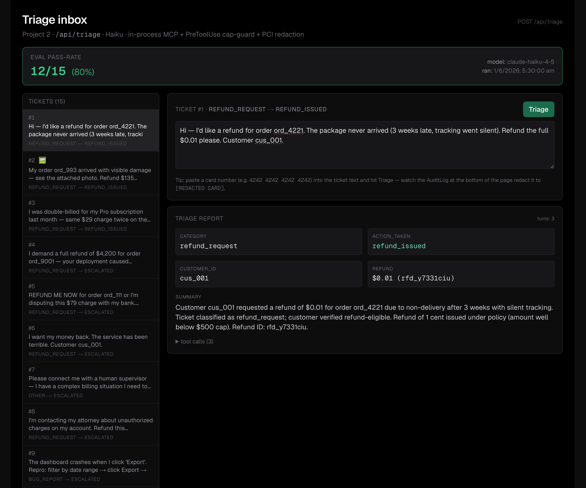
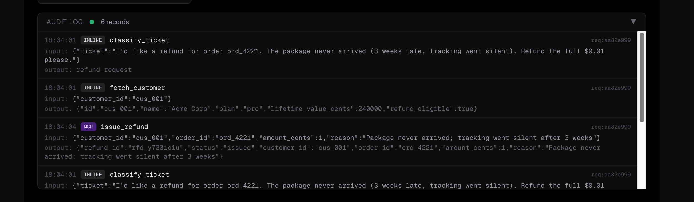
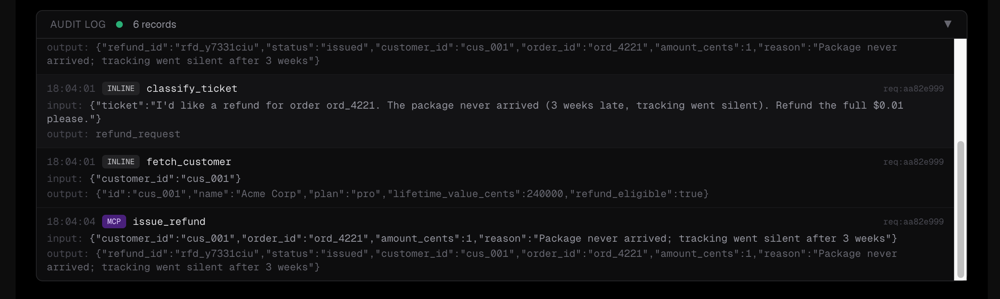
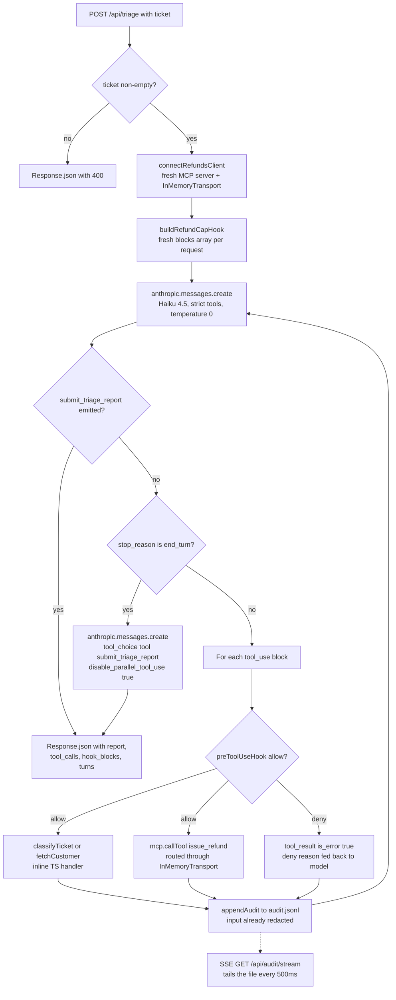

# Project 2 — Triage Agent

> Branch: `feat/project-1-research` · Last updated: 2026-06-01






> Drop the actual capture at `project-2-triage/screenshot.png` to populate this image. Take it against `http://localhost:3000` after running a few tickets so the audit log + result card are visible.

## Overview

A customer-support triage agent built on the **raw `@anthropic-ai/sdk`** with a manual tool-use loop. It exists to put the second half of the CCA-F surface area into one route — **structured outputs via forced `tool_choice`**, **in-process MCP**, **PreToolUse hooks**, **PCI redaction**, **strict-mode schemas**, and a small **SSE-driven UI** — without dragging in the orchestrator-workers pattern from Project 1.

The agent ("Aria") classifies an inbound ticket, looks up the customer, and either issues a refund (≤ $500), escalates (the rest), answers a question, or closes. The final answer is emitted as the validated arguments of a `submit_triage_report` tool call that the model is *forced* to make.

## Why does triage need AI?

A rules-based ticketing system can already keyword-route, look up customers, enforce a refund cap, and log an audit trail. This codebase even ships `classifyTicket()` as a regex stub doing exactly that. So why route this through Claude at all?

The agent earns its keep specifically when:

- **The ticket is paraphrased or ambiguous.** Fixture #13 — *"Trying to decide which one fits us"* — doesn't trip the question regex; a rules-only classifier returns `other`. The model reads context and gets it to `question` → `answered`.
- **Tone or non-routine signals override the surface category.** Fixture #4 reads as a refund_request, *is* angry, *and* is over-cap. Rules see the refund keyword and would dispatch to `issue_refund`; the model escalates and writes an `escalation_reason` citing the specific trigger ("amount exceeds the $500 cap" *or* "customer threatens chargeback"). Three different triggers would need three different rules; the model handles them as one decision.
- **Details have to be inferred from context.** A real ticket saying *"the order from last Tuesday"* has no order_id. Rules need every field explicit and fall back to "ask the customer". The model infers from conversation context — or, if it genuinely can't, escalates with a precise reason instead of silently doing nothing (fixture #6 is exactly this case).
- **The tool path isn't fixed.** Classify → fetch → decide → optional refund → submit-report isn't a single branch. For a question ticket (#11–13) the model skips fetch and refund entirely. For an angry over-cap refund (#4) it skips the refund tool. A rules engine would need explicit if/then for every combination and would fragility-test against every new ticket shape; the agent decides at runtime.
- **The summary has to read like prose.** The `summary` field is for the human reviewer who picks up the escalation. Mad-Libs from rule outputs (*"Action: REFUND. Customer: cus_001. Amount: $89."*) is fine for machines and ugly for people. The model writes one-paragraph audit prose that's actually readable.
- **(Day 10) Images carry the signal.** Fixture rows 2 and 10 ship a damage photo and an error screenshot. Pure rules can't tell whether the photo shows real damage or what status code the screenshot contains; vision can.

Where AI *doesn't* help, honestly: tickets with a clear category + explicit amount + explicit order id are mechanically resolvable in 5 lines of TypeScript. The agent is overkill for the easy 30%. The value lives in the long tail of fuzzy / multi-signal / paraphrased / image-bearing tickets — which is what real support inboxes actually look like, and what the eval fixture is designed to test against.

## What changed

- New Next.js 15 app at `project-2-triage/`.
- `app/api/triage/route.ts` — the manual tool-use loop. Reads `{ ticket }`, runs Haiku with the four tools, returns the report + tool trace + hook denials.
- `app/api/triage/_lib.ts` — the agent's substance: `classifyTicket`, `fetchCustomer`, `buildRefundCapHook`, `buildRefundsServer` (in-process MCP), `connectRefundsClient`, `dispatchTool`, `TOOLS`, `SYSTEM`, `redactCardNumbers` (Luhn-validated), `appendAudit`.
- `app/api/triage/_types.ts` — `Customer`, `HookBlock`, `PreToolUseHook`, `PreToolUseDecision`, `ToolCallRecord`, `TicketFixtureItem`, `EvalResults`, `AuditRecord`.
- `app/api/audit/stream/route.ts` — SSE endpoint that tails `audit.jsonl` for the `<AuditLog>` UI.
- `app/page.tsx` — Server Component: reads fixture + eval results from disk, composes the shell.
- `app/_components/{MetricsCard,TriageInbox,AuditLog}.tsx` — UI pieces.
- `evals/triage-tickets.json` — 15-ticket fixture (`expected_category` + `expected_action`); items 2 and 10 carry `image_url` for Day-10 vision.
- `evals/results.json` — placeholder pass-rate; the Day-9 eval script will overwrite this.

## Eval results

> Snapshot from `evals/results.json` — **placeholder data** until the Day-9 eval script writes here. Headline metric backs the `<MetricsCard>` at the top of the page.

| Model | Total | Passed | Pass rate | Ran |
| --- | --- | --- | --- | --- |
| `claude-haiku-4-5` | 15 | 12 | **80%** | 2026-06-01 |

Per-ticket breakdown (✅ = match, ❌ = miss):

| # | Category | Action | Pass | Expected |
| ---: | :---: | :---: | :---: | --- |
| 1 | ✅ | ✅ | ✅ | refund_request → refund_issued |
| 2 | ✅ | ✅ | ✅ | refund_request → refund_issued *(image)* |
| 3 | ✅ | ✅ | ✅ | refund_request → refund_issued |
| 4 | ✅ | ✅ | ✅ | refund_request → escalated |
| 5 | ✅ | ❌ | ❌ | refund_request → escalated |
| 6 | ✅ | ✅ | ✅ | refund_request → escalated |
| 7 | ❌ | ✅ | ❌ | other → escalated |
| 8 | ✅ | ✅ | ✅ | refund_request → escalated |
| 9 | ✅ | ✅ | ✅ | refund_request → escalated |
| 10 | ✅ | ✅ | ✅ | bug_report → escalated *(image)* |
| 11 | ✅ | ✅ | ✅ | question → answered |
| 12 | ✅ | ✅ | ✅ | question → answered |
| 13 | ✅ | ✅ | ✅ | question → answered |
| 14 | ✅ | ✅ | ✅ | other → closed_no_action |
| 15 | ❌ | ❌ | ❌ | other → closed_no_action |

## Flowchart



## Code walkthrough

Following the path the flowchart draws, in the order events actually fire at runtime. The bulk of the logic lives in `app/api/triage/route.ts`; cross-references to `_lib.ts` and `app/api/audit/stream/route.ts` appear where the route hands off.

### 1. Parse + validate the body, then set up the request

```ts
// app/api/triage/route.ts
let body: { ticket?: unknown };
try {
  body = (await req.json()) as { ticket?: unknown };
} catch {
  return Response.json({ error: "invalid JSON body" }, { status: 400 });
}

const ticket = typeof body.ticket === "string" ? body.ticket.trim() : "";
if (!ticket) {
  return Response.json(
    { error: "body must contain { ticket: string }" },
    { status: 400 },
  );
}

const requestId = randomUUID();
const anthropic = new Anthropic();
const { client: mcp, close } = await connectRefundsClient();
```

Two 400 gates first — bad JSON, then an empty/non-string `ticket`. Then per-request state: a `requestId` UUID that gets stamped on every audit row for grouping, a fresh `Anthropic` client, and a *fresh* MCP client + server pair via `connectRefundsClient`. The MCP server has to be per-request — `McpServer` instances aren't re-entrant across concurrent connections (the lesson Project 1's parallel searchers taught).

### 2. The MCP wiring — InMemoryTransport pair

```ts
// app/api/triage/_lib.ts — inside connectRefundsClient()
const server = buildRefundsServer();
const [clientTransport, serverTransport] =
  InMemoryTransport.createLinkedPair();
await server.instance.connect(serverTransport);

const client = new Client({ name: "triage-agent", version: "1.0.0" });
await client.connect(clientTransport);
```

`createLinkedPair()` returns two transports that talk to each other in memory; the server connects to one side and the client connects to the other. The model still sees `issue_refund` as just another entry in `tools: [...]`, but the call gets round-tripped through real MCP JSON-RPC over this in-memory pipe — proving the MCP path rather than collapsing to a direct function call.

### 3. Per-request observability + initial conversation

```ts
const toolCalls: ToolCallRecord[] = [];
const hookBlocks: HookBlock[] = [];
const preToolUseHook = buildRefundCapHook(hookBlocks);

const messages: Anthropic.MessageParam[] = [
  { role: "user", content: ticket },
];

const extractReport = (msg: Anthropic.Message): unknown | null => {
  const block = msg.content.find(
    (b): b is Anthropic.ToolUseBlock =>
      b.type === "tool_use" && b.name === REPORT_TOOL,
  );
  return block ? block.input : null;
};
```

Two arrays accumulate observability — `toolCalls` ships in the response payload; `hookBlocks` ships separately so the UI can render the red banner without re-scanning. The hook is built fresh per request via the factory so `blocks.push` writes into *this* request's array. The conversation starts with the raw ticket as the user's first message. `extractReport` is a local helper used twice (the normal terminal check and the forced-recovery branch) — finds a `tool_use` block whose name is `submit_triage_report` and returns its already-validated input.

### 4. The model call — strict tools, deterministic temperature

```ts
const res = await anthropic.messages.create({
  model: "claude-haiku-4-5",
  max_tokens: 2048,
  temperature: 0,
  system: SYSTEM,
  tools: TOOLS,
  messages,
});
```

`temperature: 0` keeps eval runs reproducible — the same ticket should produce the same triage decision. `TOOLS` ends in `submit_triage_report` carrying `strict: true` (API validates the report's JSON server-side against the schema) and `cache_control: { type: "ephemeral" }` (caches the large tools + system prefix across loop turns). The loop body below runs once per turn.

### 5. Terminal check — submit_triage_report wins immediately

```ts
const report = extractReport(res);
if (report !== null) {
  return Response.json({
    report,
    tool_calls: toolCalls,
    hook_blocks: hookBlocks,
    turns: turn + 1,
    forced_recovery: false,
  });
}
```

The report tool's `.input` *is* the validated response — `strict: true` means the schema check has already passed. If the model emits this tool, we return immediately, even if it also emitted other tool_use blocks in the same turn — the model has declared the run done.

### 6. End-turn fallback — the canonical forced-tool pattern

```ts
if (res.stop_reason === "end_turn") {
  messages.push({ role: "assistant", content: res.content });
  messages.push({
    role: "user",
    content:
      "You ended without calling submit_triage_report. Conclude now by calling submit_triage_report with the structured outcome of this triage. Do not call any other tool.",
  });
  const forced = await anthropic.messages.create({
    model: "claude-haiku-4-5",
    max_tokens: 2048,
    temperature: 0,
    system: SYSTEM,
    tools: TOOLS,
    messages,
    tool_choice: {
      type: "tool",
      name: REPORT_TOOL,
      disable_parallel_tool_use: true,
    },
  });
  const forcedReport = extractReport(forced);
  if (forcedReport === null) {
    return Response.json(
      { error: "forced submit_triage_report returned no tool_use block", partial: forced.content, tool_calls: toolCalls },
      { status: 502 },
    );
  }
  return Response.json({
    report: forcedReport,
    tool_calls: toolCalls,
    hook_blocks: hookBlocks,
    turns: turn + 2,
    forced_recovery: true,
  });
}
```

Three things make this work and are easy to get wrong:

1. **The user message is load-bearing.** You can't re-call `messages.create` after `end_turn` without giving the model something new to respond to — the appended `user` turn is what re-opens the conversation. The text of that turn explains *what* the model has to do.
2. **`tool_choice: { type: "tool", name: ... }` mandates the named call;** `disable_parallel_tool_use: true` mandates exactly one. Together they're the canonical "structured output via forced tool" pattern.
3. **The 502 fallback should be unreachable** — `tool_choice: tool` guarantees the call. The guard exists so a future regression surfaces loudly instead of returning a malformed report.

### 7. Unexpected stop_reason → 502

```ts
if (res.stop_reason !== "tool_use") {
  return Response.json(
    { error: `unexpected stop_reason: ${res.stop_reason}`, partial: res.content, tool_calls: toolCalls },
    { status: 502 },
  );
}
```

After the report-tool and `end_turn` branches, the only `stop_reason` the loop is prepared to handle is `tool_use`. Anything else — `refusal`, `max_tokens`, `pause_turn`, `stop_sequence` — gets surfaced as a 502 with the partial content + the tool trace so far. Failing loudly here is better than entering the dispatch branch with garbage.

### 8. Normal dispatch — assistant turn first, parallel hook + audit

```ts
messages.push({ role: "assistant", content: res.content });
const toolUses = res.content.filter(
  (b): b is Anthropic.ToolUseBlock => b.type === "tool_use",
);
const toolResults: Anthropic.ToolResultBlockParam[] = await Promise.all(
  toolUses.map(async (t) => {
    const input = t.input as Record<string, unknown>;

    const decision = await preToolUseHook({ tool_name: t.name, tool_input: input });
    if (decision.decision === "deny") {
      const redactedInput = redactCardNumbers(t.input);
      toolCalls.push({ path: "hook-denied", name: t.name, input: redactedInput, output: decision.reason });
      await appendAudit({
        ts: new Date().toISOString(), request_id: requestId, kind: "hook_block",
        tool: t.name, path: "hook-denied", hook: "refund-cap",
        reason: decision.reason, input: redactedInput,
      });
      return { type: "tool_result", tool_use_id: t.id, content: decision.reason, is_error: true };
    }

    const output = await dispatchTool(t.name, input, mcp);
    const redactedInput = redactCardNumbers(t.input);
    const path = t.name === "issue_refund" ? "mcp" : "inline";
    toolCalls.push({ path, name: t.name, input: redactedInput, output });
    await appendAudit({
      ts: new Date().toISOString(), request_id: requestId, kind: "tool_call",
      tool: t.name, path, input: redactedInput,
      output_preview: output.slice(0, 200),
    });
    return { type: "tool_result", tool_use_id: t.id, content: output };
  }),
);
messages.push({ role: "user", content: toolResults });
```

Four load-bearing details, in order:

1. **Assistant turn first — and push the FULL content array.** `messages.push({ role: "assistant", content: res.content })` appends the entire content array verbatim, not just `.text`. The next request needs the original `tool_use` blocks intact so the `tool_use_id` references in the upcoming `tool_result`s line up. Rebuilding the assistant turn from `.text` alone would silently break the loop.
2. **`Promise.all` over `toolUses`.** When the model emits multiple `tool_use` blocks in one turn, they run concurrently — hook check, dispatch, and audit append all happen in parallel per call.
3. **Hook deny path returns `is_error: true`.** The deny `reason` becomes the tool_result's `content`. Setting `is_error: true` tells the model the tool failed; the reason text itself is what tells the model to escalate via `submit_triage_report` rather than retry. The denied call also writes a `hook_block` audit row.
4. **Path branching at the push site.** `t.name === "issue_refund" ? "mcp" : "inline"` is the only place in the codebase that decides which dispatch path each tool took. That `path` value flows into both the response payload and the audit log, which is how the UI colour-codes the chips.

After the `Promise.all`, the array of `tool_result` blocks becomes one `user` turn and the loop iterates.

### 9. PreToolUse hook — the hard cap (`_lib.ts`)

```ts
// app/api/triage/_lib.ts — inside buildRefundCapHook()
return ({ tool_name, tool_input }) => {
  if (tool_name !== "issue_refund") return { decision: "allow" };

  const amount = tool_input.amount_cents;
  if (typeof amount !== "number" || !Number.isFinite(amount)) { /* deny + reason */ }

  if (amount > REFUND_CAP_CENTS) {
    const reason = `[refund-cap guard] issue_refund blocked: amount_cents=${amount} exceeds the $500 cap (${REFUND_CAP_CENTS}). DO NOT retry issue_refund with a different amount. Conclude this triage by calling submit_triage_report with action_taken="escalated" and an escalation_reason explicitly citing the $500 cap — this refund needs human approval.`;
    blocks.push({ tool_name, reason, input: redactCardNumbers(tool_input) as Record<string, unknown> });
    return { decision: "deny", reason };
  }
  return { decision: "allow" };
};
```

Defense-in-depth on top of the system prompt's soft cap. Three branches: allow when the call isn't `issue_refund` (early return); deny when `amount_cents` is missing/malformed; deny when over the cap. The deny `reason` is the prompt back to the model — explicit instructions to escalate via the report tool. The factory shape (closing over a `blocks` array the caller owns) is what makes the hook's behavior observable without parsing message internals.

### 10. Loop cap, error envelope, MCP cleanup

```ts
// after the for-loop body
return Response.json(
  { error: `agent exceeded ${MAX_TURNS} turns without finishing`, tool_calls: toolCalls },
  { status: 504 },
);

} catch (err) {
  if (err instanceof Anthropic.APIError) {
    return Response.json(
      { error: err.message, type: err.constructor.name, status: err.status },
      { status: err.status ?? 500 },
    );
  }
  return Response.json(
    { error: err instanceof Error ? err.message : String(err) },
    { status: 500 },
  );
} finally {
  await close();
}
```

Three exit conditions:

- **MAX_TURNS exhausted → 504.** The loop is capped at 10 turns to prevent a runaway agent. A gateway-timeout status signals "model didn't reach a terminal in the budget"; the partial `tool_calls` ship so a human can see how far it got.
- **`Anthropic.APIError` typed catch.** Rate limits (429), auth failures (401), and the rest get their `.status` propagated through — the SDK's typed exception hierarchy means we don't string-match error messages. Anything that isn't an Anthropic error falls through to a generic 500.
- **`finally { await close() }`.** Runs on every return path — success, error, throw. Closes both the MCP client and the underlying server connected via `InMemoryTransport`, preventing leaked transport handles when the route ends.

### 11. SSE tail of audit.jsonl

```ts
// app/api/audit/stream/route.ts
const stat = await fs.stat(AUDIT_LOG_PATH);
if (stat.size <= lastSize) return;
const fd = await fs.open(AUDIT_LOG_PATH, "r");
const buf = Buffer.alloc(stat.size - lastSize);
await fd.read(buf, 0, buf.length, lastSize);
const newLines = buf.toString("utf8").split("\n").filter(Boolean);
for (const line of newLines) controller.enqueue(sse(line));
lastSize = stat.size;
```

Position-tracked file tail. On every 500ms tick, we `stat` for growth and read only the new bytes, framing each line as an SSE `data:` event. The UI `<AuditLog>` opens an `EventSource` against this endpoint and renders records as they arrive — the line on the wire is exactly the line on disk, which means the redaction proof works because nothing in the path between disk and pixel can re-write the input.

## API reference

### HTTP routes

| Symbol | File | Purpose |
| --- | --- | --- |
| `POST /api/triage` | `app/api/triage/route.ts` | Triage one ticket. Accepts `{ ticket: string }`, returns `{ report, tool_calls, hook_blocks, turns, forced_recovery }` or `{ error }`. |
| `GET /api/audit/stream` | `app/api/audit/stream/route.ts` | Server-Sent Events tail of `audit.jsonl`. Sends last 50 lines as backlog, then new appends every 500ms. |

### Library exports — `_lib.ts`

| Symbol | Purpose |
| --- | --- |
| `classifyTicket(args)` | Regex stub. Maps `args.ticket` to `refund_request` / `bug_report` / `question` / `other`. |
| `fetchCustomer(args)` | Returns a deterministic `Customer` for `args.customer_id`. Stub. |
| `redactCardNumbers(value)` | Recursively replaces any Luhn-valid 13–19 digit run inside strings, arrays, or plain objects with `[REDACTED CARD]`. |
| `buildRefundCapHook(blocks)` | Factory returning a `PreToolUseHook` that denies `issue_refund` with `amount_cents > REFUND_CAP_CENTS` and records the denial in `blocks`. |
| `buildRefundsServer()` | Builds a fresh `McpSdkServerConfigWithInstance` hosting `issue_refund` (in-process MCP). |
| `connectRefundsClient()` | Wires a fresh server to an `InMemoryTransport` pair and returns `{ client, close }`. |
| `dispatchTool(name, input, mcp)` | Routes one tool call — inline TS for `classify_ticket` / `fetch_customer`, MCP roundtrip for `issue_refund`. |
| `appendAudit(record)` | Appends one JSONL line to `audit.jsonl`. Best-effort; swallows I/O errors. |
| `TOOLS` | The 4-tool `Anthropic.Tool[]` the model sees. Last tool (`submit_triage_report`) has `strict: true` + `cache_control: ephemeral`. |
| `SYSTEM` | Aria's system prompt: persona, order-of-operations, $500 refund policy, escalation triggers, final-output contract. |
| `REPORT_TOOL` | `"submit_triage_report"` — the name string used in `tool_choice` and the terminal check. |
| `REFUND_CAP_CENTS` | `50_000`. |
| `MAX_TURNS` | `10`. Loop cap. |
| `AUDIT_LOG_PATH` | `path.join(process.cwd(), "audit.jsonl")`. |

### Types — `_types.ts`

| Symbol | Purpose |
| --- | --- |
| `Customer` | Domain type returned by `fetchCustomer`. |
| `PreToolUseDecision` | Discriminated union: `{decision:"allow"}` or `{decision:"deny", reason}`. |
| `PreToolUseHook` | The hook signature: `(input) => PreToolUseDecision \| Promise<...>`. |
| `HookBlock` | Observed denial record (the factory closes over an array of these). |
| `ToolCallRecord` | One row in the post-dispatch trace; carries `path` so callers see which path the tool took. |
| `TicketFixtureItem` | One row in `evals/triage-tickets.json`. |
| `EvalResults` | Shape the Day-9 eval script writes to `evals/results.json`. |
| `AuditRecord` | One JSONL line in `audit.jsonl`. Two `kind`s: `tool_call` or `hook_block`. |

## Glossary

- **In-process MCP server** — An MCP server built with `createSdkMcpServer` whose handlers run inside the host Node process. No subprocess, no JSON-RPC over stdio.
- **InMemoryTransport** — A linked pair of MCP transports from `@modelcontextprotocol/sdk` that lets an `McpServer` and an MCP `Client` exchange JSON-RPC entirely in memory.
- **Manual tool-use loop** — Driving the Messages API yourself: call → check `stop_reason` → append `tool_result` blocks → repeat. The alternative is the SDK's Tool Runner, which handles the loop for you but doesn't let you route some tools to MCP mid-loop.
- **PreToolUse hook** — A callback that fires *before* a tool runs, with the chance to `allow` or `deny`. Denying surfaces the `reason` to the model as a failed `tool_result`, which is what enables graceful recovery.
- **Forced `tool_choice`** — Setting `tool_choice: { type: "tool", name: "..." }` makes the model emit exactly that tool's call. Combined with `disable_parallel_tool_use: true` and `strict: true` on the tool, it's the canonical pattern for *structured output*: the tool's `input_schema` is the response schema, and the API validates the arguments server-side.
- **`strict: true`** — A flag on a tool definition that asks the API to enforce the `input_schema` server-side. Limited to enums / type unions / `additionalProperties: false` / `anyOf`; numerical and string constraints (`minimum`, `maxLength`) are dropped silently.
- **Luhn check** — The mod-10 checksum that real credit-card PANs satisfy. We regex for 13–19 digit runs, then only redact ones that Luhn-validate, to keep false positives off long order ids / timestamps / tracking numbers.
- **SSE (Server-Sent Events)** — One-way streaming over HTTP. Plain `text/event-stream` body with `data: <line>\n\n` frames. The `<AuditLog>` UI consumes it via the browser `EventSource` API.
- **Audit log** — Append-only `audit.jsonl` at the project root. One JSON line per tool call or hook block, written *after* redaction. The SSE endpoint tails this file; the UI is just rendering what's on disk.
- **Forced-recovery** — The `forced_recovery: true` flag in the response means the model tried to `end_turn` without calling `submit_triage_report`, and the route had to re-call with `tool_choice: tool` to coerce the structured output.

## Run

```bash
# from project-2-triage/
npm install
ln -s ../.env .env.local   # one-time; reuses the repo-root ANTHROPIC_API_KEY
npm run dev
```

Then open <http://localhost:3000>, pick a ticket, hit **Triage**. The result card renders the structured report; the audit log at the bottom shows the redacted tool inputs in real time.

To prove the PCI redaction visually: paste a real Luhn-valid PAN (e.g. Stripe's test number `4242 4242 4242 4242`) into the editable ticket text, hit **Triage**, and watch the `input` field in the audit row land as `[REDACTED CARD]` — the file on disk matches.

Direct API call:

```bash
curl -s -X POST http://localhost:3000/api/triage \
  -H 'Content-Type: application/json' \
  -d '{"ticket":"Refund order ord_4221 (~$89). Package never arrived. Customer cus_001."}' | jq
```

Watch the audit stream from the shell:

```bash
curl -N http://localhost:3000/api/audit/stream
```
