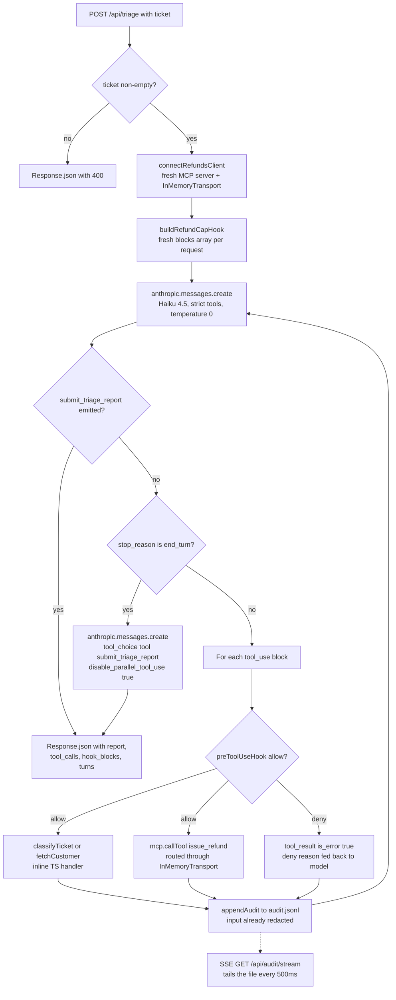

# Project 2 — Triage Agent

> Branch: `feat/project-1-research` · Last updated: 2026-06-01


> Drop the actual capture at `project-2-triage/screenshot.png` to populate this image. Take it against `http://localhost:3000` after running a few tickets so the audit log + result card are visible.

## Overview

A customer-support triage agent built on the **raw `@anthropic-ai/sdk`** with a manual tool-use loop. It exists to put the second half of the CCA-F surface area into one route — **structured outputs via forced `tool_choice`**, **in-process MCP**, **PreToolUse hooks**, **PCI redaction**, **strict-mode schemas**, and a small **SSE-driven UI** — without dragging in the orchestrator-workers pattern from Project 1.

The agent ("Aria") classifies an inbound ticket, looks up the customer, and either issues a refund (≤ $500), escalates (the rest), answers a question, or closes. The final answer is emitted as the validated arguments of a `submit_triage_report` tool call that the model is *forced* to make.

## What changed

- New Next.js 15 app at `project-2-triage/`.
- `app/api/triage/route.ts` — the manual tool-use loop. Reads `{ ticket }`, runs Haiku with the four tools, returns the report + tool trace + hook denials.
- `app/api/triage/_lib.ts` — the agent's substance: `classifyTicket`, `fetchCustomer`, `buildRefundCapHook`, `buildRefundsServer` (in-process MCP), `connectRefundsClient`, `dispatchTool`, `TOOLS`, `SYSTEM`, `redactCardNumbers` (Luhn-validated), `appendAudit`.
- `app/api/triage/_types.ts` — `Customer`, `HookBlock`, `PreToolUseHook`, `PreToolUseDecision`, `ToolCallRecord`, `TicketFixtureItem`, `EvalResults`, `AuditRecord`.
- `app/api/audit/stream/route.ts` — SSE endpoint that tails `audit.jsonl` for the `<AuditLog>` UI.
- `app/page.tsx` — Server Component: reads fixture + eval results from disk, composes the shell.
- `app/_components/{MetricsCard,TriageInbox,AuditLog}.tsx` — UI pieces.
- `evals/triage-tickets.json` — 15-ticket fixture (`expected_category` + `expected_action`); items 2 and 10 carry `image_url` for Day-10 vision.
- `evals/results.json` — placeholder pass-rate; the Day-9 eval script will overwrite this.

## Eval results

> Snapshot from `evals/results.json` — **placeholder data** until the Day-9 eval script writes here. Headline metric backs the `<MetricsCard>` at the top of the page.

| Model | Total | Passed | Pass rate | Ran |
| --- | --- | --- | --- | --- |
| `claude-haiku-4-5` | 15 | 12 | **80%** | 2026-06-01 |

Per-ticket breakdown (✅ = match, ❌ = miss):

| # | Category | Action | Pass | Expected |
| ---: | :---: | :---: | :---: | --- |
| 1 | ✅ | ✅ | ✅ | refund_request → refund_issued |
| 2 | ✅ | ✅ | ✅ | refund_request → refund_issued *(image)* |
| 3 | ✅ | ✅ | ✅ | refund_request → refund_issued |
| 4 | ✅ | ✅ | ✅ | refund_request → escalated |
| 5 | ✅ | ❌ | ❌ | refund_request → escalated |
| 6 | ✅ | ✅ | ✅ | refund_request → escalated |
| 7 | ❌ | ✅ | ❌ | other → escalated |
| 8 | ✅ | ✅ | ✅ | refund_request → escalated |
| 9 | ✅ | ✅ | ✅ | refund_request → escalated |
| 10 | ✅ | ✅ | ✅ | bug_report → escalated *(image)* |
| 11 | ✅ | ✅ | ✅ | question → answered |
| 12 | ✅ | ✅ | ✅ | question → answered |
| 13 | ✅ | ✅ | ✅ | question → answered |
| 14 | ✅ | ✅ | ✅ | other → closed_no_action |
| 15 | ❌ | ❌ | ❌ | other → closed_no_action |

## Flowchart



## Code walkthrough

Following the path the flowchart draws, in the order events actually fire at runtime.

### 1. Mint a request id and a fresh MCP client

```ts
// app/api/triage/route.ts
const requestId = randomUUID();
const anthropic = new Anthropic();
const { client: mcp, close } = await connectRefundsClient();
```

`requestId` ties every audit line for this triage to the same UUID so the UI can group them. `connectRefundsClient` builds a *fresh* `McpServer` + `InMemoryTransport` pair per request — the underlying `McpServer` instance isn't re-entrant across concurrent requests, the same lesson Project 1 learned with its parallel searchers.

### 2. The InMemoryTransport pair *is* the MCP path

```ts
// app/api/triage/_lib.ts
const server = buildRefundsServer();
const [clientTransport, serverTransport] =
  InMemoryTransport.createLinkedPair();
await server.instance.connect(serverTransport);

const client = new Client({ name: "triage-agent", version: "1.0.0" });
await client.connect(clientTransport);
```

The `tools: [...]` array Claude sees lists `issue_refund` identically to the inline tools, but its call is round-tripped through real MCP JSON-RPC over an in-memory pipe — proving the path, not collapsing to a direct function call.

### 3. The model call — strict tools, deterministic temperature

```ts
// app/api/triage/route.ts
const res = await anthropic.messages.create({
  model: "claude-haiku-4-5",
  max_tokens: 2048,
  temperature: 0,
  system: SYSTEM,
  tools: TOOLS,
  messages,
});
```

`temperature: 0` keeps eval runs reproducible. `TOOLS` ends in `submit_triage_report` which carries `strict: true` and `cache_control: { type: "ephemeral" }` — the strict flag makes the API validate the report's JSON server-side against the schema, the cache marker caches the (large) tools + system across loop turns.

### 4. Terminal check — submit_triage_report wins immediately

```ts
const extractReport = (msg: Anthropic.Message): unknown | null => {
  const block = msg.content.find(
    (b): b is Anthropic.ToolUseBlock =>
      b.type === "tool_use" && b.name === REPORT_TOOL,
  );
  return block ? block.input : null;
};

const report = extractReport(res);
if (report !== null) {
  return Response.json({ report, tool_calls, hook_blocks, turns, forced_recovery: false });
}
```

The report tool's `.input` *is* the validated response — `strict: true` means the schema check has already passed by the time we read it. If the model emits this tool, we return immediately, even if it also emitted other tool_use blocks in the same turn.

### 5. PreToolUse hook — the hard cap

```ts
// app/api/triage/_lib.ts
if (amount > REFUND_CAP_CENTS) {
  const reason = `[refund-cap guard] issue_refund blocked: amount_cents=${amount} exceeds the $500 cap (${REFUND_CAP_CENTS}). DO NOT retry issue_refund with a different amount. Conclude this triage by calling submit_triage_report with action_taken="escalated" and an escalation_reason explicitly citing the $500 cap — this refund needs human approval.`;
  blocks.push({ tool_name, reason, input: redactCardNumbers(tool_input) as Record<string, unknown> });
  return { decision: "deny", reason };
}
```

Defense-in-depth on top of the system prompt's soft cap. The deny `reason` itself is what "forces" the agent to escalate — the model reads the failure message and follows the explicit alternative path.

### 6. Dispatch + audit, in lockstep

```ts
// app/api/triage/route.ts
const output = await dispatchTool(t.name, input, mcp);
const redactedInput = redactCardNumbers(t.input);
const path = t.name === "issue_refund" ? "mcp" : "inline";
toolCalls.push({ path, name: t.name, input: redactedInput, output });
await appendAudit({
  ts: new Date().toISOString(),
  request_id: requestId,
  kind: "tool_call",
  tool: t.name,
  path,
  input: redactedInput,
  output_preview: output.slice(0, 200),
});
```

The input flows through `redactCardNumbers` *before* it touches either the response payload or the audit log. The file on disk is already PCI-clean — the UI is just rendering the file.

### 7. Forced-recovery branch

```ts
const forced = await anthropic.messages.create({
  model: "claude-haiku-4-5",
  max_tokens: 2048,
  temperature: 0,
  system: SYSTEM,
  tools: TOOLS,
  messages,
  tool_choice: { type: "tool", name: REPORT_TOOL, disable_parallel_tool_use: true },
});
```

If the model hits `end_turn` without calling `submit_triage_report`, we re-prompt with a forced tool_choice. `type: "tool"` mandates the named call; `disable_parallel_tool_use: true` mandates exactly one. The response carries `forced_recovery: true` so the UI can flag when this safety net fired.

### 8. SSE tail of audit.jsonl

```ts
// app/api/audit/stream/route.ts
const stat = await fs.stat(AUDIT_LOG_PATH);
if (stat.size <= lastSize) return;
const fd = await fs.open(AUDIT_LOG_PATH, "r");
const buf = Buffer.alloc(stat.size - lastSize);
await fd.read(buf, 0, buf.length, lastSize);
const newLines = buf.toString("utf8").split("\n").filter(Boolean);
for (const line of newLines) controller.enqueue(sse(line));
lastSize = stat.size;
```

Position-tracked file tail. On every 500ms tick, we `stat` for growth and read only the new bytes, framing each line as an SSE `data:` event. The UI `<AuditLog>` opens an `EventSource` against this endpoint and renders records as they arrive — the line on the wire is exactly the line on disk.

## API reference

### HTTP routes

| Symbol | File | Purpose |
| --- | --- | --- |
| `POST /api/triage` | `app/api/triage/route.ts` | Triage one ticket. Accepts `{ ticket: string }`, returns `{ report, tool_calls, hook_blocks, turns, forced_recovery }` or `{ error }`. |
| `GET /api/audit/stream` | `app/api/audit/stream/route.ts` | Server-Sent Events tail of `audit.jsonl`. Sends last 50 lines as backlog, then new appends every 500ms. |

### Library exports — `_lib.ts`

| Symbol | Purpose |
| --- | --- |
| `classifyTicket(args)` | Regex stub. Maps `args.ticket` to `refund_request` / `bug_report` / `question` / `other`. |
| `fetchCustomer(args)` | Returns a deterministic `Customer` for `args.customer_id`. Stub. |
| `redactCardNumbers(value)` | Recursively replaces any Luhn-valid 13–19 digit run inside strings, arrays, or plain objects with `[REDACTED CARD]`. |
| `buildRefundCapHook(blocks)` | Factory returning a `PreToolUseHook` that denies `issue_refund` with `amount_cents > REFUND_CAP_CENTS` and records the denial in `blocks`. |
| `buildRefundsServer()` | Builds a fresh `McpSdkServerConfigWithInstance` hosting `issue_refund` (in-process MCP). |
| `connectRefundsClient()` | Wires a fresh server to an `InMemoryTransport` pair and returns `{ client, close }`. |
| `dispatchTool(name, input, mcp)` | Routes one tool call — inline TS for `classify_ticket` / `fetch_customer`, MCP roundtrip for `issue_refund`. |
| `appendAudit(record)` | Appends one JSONL line to `audit.jsonl`. Best-effort; swallows I/O errors. |
| `TOOLS` | The 4-tool `Anthropic.Tool[]` the model sees. Last tool (`submit_triage_report`) has `strict: true` + `cache_control: ephemeral`. |
| `SYSTEM` | Aria's system prompt: persona, order-of-operations, $500 refund policy, escalation triggers, final-output contract. |
| `REPORT_TOOL` | `"submit_triage_report"` — the name string used in `tool_choice` and the terminal check. |
| `REFUND_CAP_CENTS` | `50_000`. |
| `MAX_TURNS` | `10`. Loop cap. |
| `AUDIT_LOG_PATH` | `path.join(process.cwd(), "audit.jsonl")`. |

### Types — `_types.ts`

| Symbol | Purpose |
| --- | --- |
| `Customer` | Domain type returned by `fetchCustomer`. |
| `PreToolUseDecision` | Discriminated union: `{decision:"allow"}` or `{decision:"deny", reason}`. |
| `PreToolUseHook` | The hook signature: `(input) => PreToolUseDecision \| Promise<...>`. |
| `HookBlock` | Observed denial record (the factory closes over an array of these). |
| `ToolCallRecord` | One row in the post-dispatch trace; carries `path` so callers see which path the tool took. |
| `TicketFixtureItem` | One row in `evals/triage-tickets.json`. |
| `EvalResults` | Shape the Day-9 eval script writes to `evals/results.json`. |
| `AuditRecord` | One JSONL line in `audit.jsonl`. Two `kind`s: `tool_call` or `hook_block`. |

## Glossary

- **In-process MCP server** — An MCP server built with `createSdkMcpServer` whose handlers run inside the host Node process. No subprocess, no JSON-RPC over stdio.
- **InMemoryTransport** — A linked pair of MCP transports from `@modelcontextprotocol/sdk` that lets an `McpServer` and an MCP `Client` exchange JSON-RPC entirely in memory.
- **Manual tool-use loop** — Driving the Messages API yourself: call → check `stop_reason` → append `tool_result` blocks → repeat. The alternative is the SDK's Tool Runner, which handles the loop for you but doesn't let you route some tools to MCP mid-loop.
- **PreToolUse hook** — A callback that fires *before* a tool runs, with the chance to `allow` or `deny`. Denying surfaces the `reason` to the model as a failed `tool_result`, which is what enables graceful recovery.
- **Forced `tool_choice`** — Setting `tool_choice: { type: "tool", name: "..." }` makes the model emit exactly that tool's call. Combined with `disable_parallel_tool_use: true` and `strict: true` on the tool, it's the canonical pattern for *structured output*: the tool's `input_schema` is the response schema, and the API validates the arguments server-side.
- **`strict: true`** — A flag on a tool definition that asks the API to enforce the `input_schema` server-side. Limited to enums / type unions / `additionalProperties: false` / `anyOf`; numerical and string constraints (`minimum`, `maxLength`) are dropped silently.
- **Luhn check** — The mod-10 checksum that real credit-card PANs satisfy. We regex for 13–19 digit runs, then only redact ones that Luhn-validate, to keep false positives off long order ids / timestamps / tracking numbers.
- **SSE (Server-Sent Events)** — One-way streaming over HTTP. Plain `text/event-stream` body with `data: <line>\n\n` frames. The `<AuditLog>` UI consumes it via the browser `EventSource` API.
- **Audit log** — Append-only `audit.jsonl` at the project root. One JSON line per tool call or hook block, written *after* redaction. The SSE endpoint tails this file; the UI is just rendering what's on disk.
- **Forced-recovery** — The `forced_recovery: true` flag in the response means the model tried to `end_turn` without calling `submit_triage_report`, and the route had to re-call with `tool_choice: tool` to coerce the structured output.

## Run

```bash
# from project-2-triage/
npm install
ln -s ../.env .env.local   # one-time; reuses the repo-root ANTHROPIC_API_KEY
npm run dev
```

Then open <http://localhost:3000>, pick a ticket, hit **Triage**. The result card renders the structured report; the audit log at the bottom shows the redacted tool inputs in real time.

To prove the PCI redaction visually: paste a real Luhn-valid PAN (e.g. Stripe's test number `4242 4242 4242 4242`) into the editable ticket text, hit **Triage**, and watch the `input` field in the audit row land as `[REDACTED CARD]` — the file on disk matches.

Direct API call:

```bash
curl -s -X POST http://localhost:3000/api/triage \
  -H 'Content-Type: application/json' \
  -d '{"ticket":"Refund order ord_4221 (~$89). Package never arrived. Customer cus_001."}' | jq
```

Watch the audit stream from the shell:

```bash
curl -N http://localhost:3000/api/audit/stream
```
